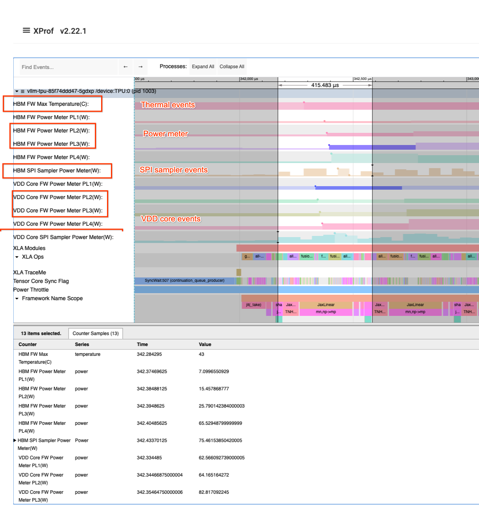

# Advanced Profiler Options

This document lists advanced profiling flags that are available in XProf but
may not be documented in the main JAX profiling guide. These flags are typically
used for fine-grained control, power monitoring, and detailed performance
counter sampling on TPUs.

These flags are passed via the `profiler_options` parameter in
`jax.profiler.start_trace` as part of the `advanced_configuration` dictionary.

Example:
```python
options = jax.profiler.ProfileOptions()
options.advanced_configuration = {
    "tpu_power_trace_level": 1,  # Integer
    "tpu_perf_counters": True,  # Boolean
    "tpu_cpu_perf_counter_profile_events": "context-switches,page-faults",  # String
}
jax.profiler.start_trace("/tmp/profile-data", profiler_options=options)
```

## Power and Thermal Events

These flags control the collection of power and thermal events on TPUs.

*   **`tpu_power_trace_level`** (Integer): Controls the level of power tracing.
    Supported values:
    *   `0`: `POWER_TRACE_NONE` (Default)
    *   `1`: `POWER_TRACE_NORMAL`
    *   `2`: `POWER_TRACE_SPI` (Enable SPI power trace, verbose)
*   **`tpu_e2e_enable_fw_throttle_event`** (Boolean): Enables firmware throttle
    events.
*   **`tpu_e2e_enable_fw_power_level_event`** (Boolean): Enables firmware power
    level events.
*   **`tpu_e2e_enable_fw_thermal_event`** (Boolean): Enables firmware thermal
    events.

*Note: Legacy versions without the `tpu_` prefix (e.g.,
`e2e_enable_fw_throttle_event`) are also supported for backwards
compatibility.*



## Tracemark Configuration

*   **`tpu_tracemark_lower`** (Integer): Lower bound for tracemark.
*   **`tpu_tracemark_upper`** (Integer): Upper bound for tracemark.

*Note: Legacy versions without the `tpu_` prefix (e.g., `tracemark_lower`) are
also supported for backwards compatibility.*

## Periodic Counter Sampling Options

These options configure periodic sampling of various performance counters on the
TPU.

*   **`tpu_enable_periodic_counter_sampling`** (Boolean): Enables periodic
    counter sampling.
*   **`tpu_tc_perf_counter_sampling_options`** (String): Options for TC perf
    counter sampling. Expects a text proto string of
    `xprof::XprofRequest::PeriodicCounterSamplingOptions`.
*   **`tpu_scs_perf_counter_sampling_options`** (String): Options for SCS perf
    counter sampling.
*   **`tpu_sctc_perf_counter_sampling_options`** (String): Options for SCTC perf
    counter sampling.
*   **`tpu_sctd_perf_counter_sampling_options`** (String): Options for SCTD perf
    counter sampling.
*   **`tpu_cmn_perf_counter_sampling_options`** (String): Options for CMN perf
    counter sampling.
*   **`tpu_icr_perf_counter_sampling_options`** (String): Options for ICR perf
    counter sampling.

## Other Advanced TPU Options

*   **`tpu_perf_counters`** (Boolean): Boolean to enable/disable TPU
    performance counters.
*   **`max_trace_buffers`** (Integer): Controls the maximum size of trace
    buffers.
*   **`tpu_circular_buffer_tracing`** (Boolean): Enables circular buffer
    tracing.
*   **`enable_continuous_profiling`** (Boolean): Enables continuous profiling.
*   **`tpu_watched_sync_flag_number`** (Integer): Watched sync flag number.
*   **`tpu_watched_sync_flag_mask`** (Integer): Watched sync flag mask.
*   **`tpu_sc_dma`** (Boolean): Controls TPU SC DMA tracing.
