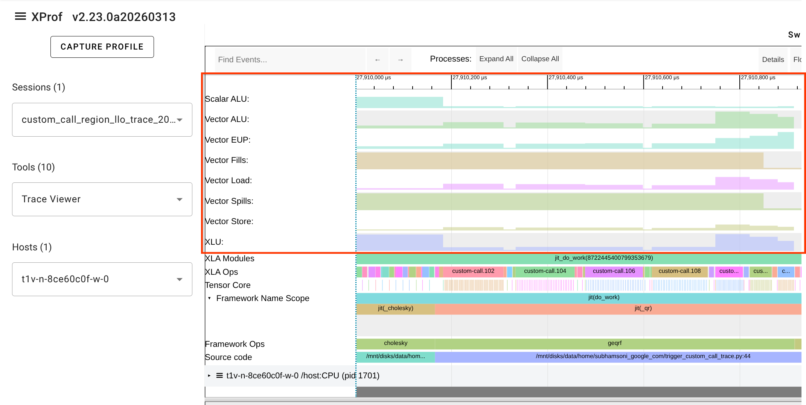

# Custom Call Profiling

XLA Custom Calls allow you to execute custom kernels or operations that are not
natively supported by XLA. To gain visibility into the performance of these
custom calls within the [Trace Viewer](trace_viewer.md), you can use specific
XLA flags to enable detailed tracing and LLO (Low-Level Optimizer) debug
information.

## Enabling Custom Call Visibility

To enable custom call profiling, you need to set the following XLA flags when
running your workload:

- `--xla_enable_custom_call_region_trace=true`: This flag enables tracing for
  regions containing custom calls.
- `--xla_xprof_register_llo_debug_info=true`: This flag registers LLO debug
  information, which allows XProf to display detailed utilization statistics for
  the custom call.

Example :

```shell
LIBTPU_INIT_ARGS="--xla_enable_custom_call_region_trace=true --xla_xprof_register_llo_debug_info=true" python your_jax_workload.py
```

When these flags are enabled, a new **LLO utilization** line will appear in the
Trace Viewer for each TPU core or device executing the custom call.

## LLO Utilization Line

The **LLO utilization** line provides a visualization of how hardware resources
are used during the execution of a custom call. This is particularly useful for
identifying bottlenecks within custom kernels (e.g., those written in Pallas or
Mosaic).



*Note: The image above shows an example of the LLO utilization line in the Trace
Viewer.*

## Best Practices

- **Only enable when needed**: These flags can increase the size of the captured
  profile and may slightly impact performance during collection. Use them
  primarily for debugging and optimizing custom calls.
- **Check for LLO information**: If you enable these flags but don't see the LLO
  utilization line, ensure that your compiler backend supports registering LLO
  debug info for your specific custom call implementation.
