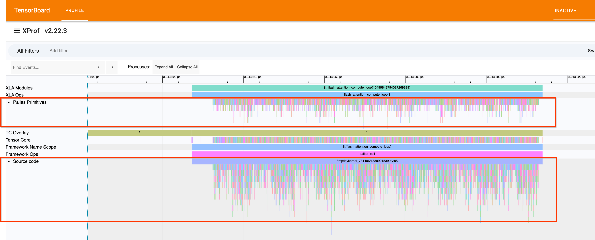
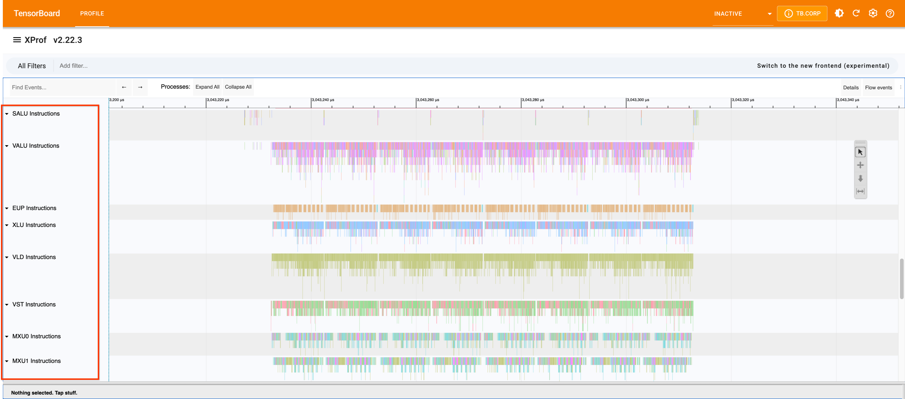

# Custom Call Profiling

XLA Custom Calls allow you to execute custom kernels or operations that are not
natively supported by XLA. To gain visibility into the performance of these
custom calls within the [Trace Viewer](trace_viewer.md), you can use specific
XLA flags to enable detailed tracing and LLO (Low-Level Optimizer) debug
information.

## How to Enable Tracing

Set the following XLA flag to recompile your workload with instrumentation:

```bash
--xla_xprof_enable_custom_call_tracing=true
```

If you are running on Cloud TPU via `LIBTPU_INIT_ARGS`, you can pass it like
this:

```bash
LIBTPU_INIT_ARGS="--xla_xprof_enable_custom_call_tracing=true --xla_xprof_register_llo_debug_info=true" python your_jax_workload.py
```

### Example Trace Viewer

Here is an example of what the LLO traces look like in the Xprof Trace Viewer:




--------------------------------------------------------------------------------

### Advanced Parameters (Handling Event Drops)

If you see **event drops** or buffer overflows in Xprof, it means the trace
points are being triggered too frequently, overwhelming the hardware trace
buffers. You can tune the frequency of LLO trace insertion using advanced
parameters.

These parameters are configured via `xla_tpu_bundle_instrumentation_options`.
You can control how often traces are packed into instruction bundles.

#### Key Parameters:

*   **`trace_best_effort_frequency`** (Default: 10): The target interval (in
    bundles) for inserting opportunistic traces packed into existing bundles.
    The compiler will try to insert a trace this often but will **not** create
    new bundles for it.
*   **`trace_guaranteed_frequency`** (Default: 10): The maximum number of
    bundles allowed between two traces. This is a guarantee. Whenever we cannot
    satisfy this by packing traces into existing bundles, we will create a new
    bundle and place a trace there (by itself).

#### How to Tune:

*   **If you see Event Drops**: **Increase** the values (e.g., set to 50 or 100)
    to trace **less frequently**, reducing the volume of trace data generated.
*   **If you need finer granularity**: **Decrease** the values to trace more
    frequently (at the cost of higher overhead and potential buffer overflows).

--------------------------------------------------------------------------------

### How Instruction Cycle Counts are Calculated

Because trace points are injected opportunistically rather than at every single
instruction, intermediate timestamps are interpolated based on estimated
hardware cycle costs.

The compiler calculates the intrinsic hardware cycle cost of each LLO
instruction based on the target TPU generation and the Execution Unit resolving
it. These cycle counts represent execution throughput and latency delays.

#### High-Level Flow

1.  **Parse LLO Instruction**: Identify the Opcode and Metadata.
2.  **Get Base Hardware Cycles**: Determine cycles based on TPU Generation
    (v5e/v5p, v6e/v7x, etc.).
3.  **Convert to GTC Ticks**: Translate cycles to Global Timer Counter (GTC)
    ticks using formula: `Cycles * (GTC_Freq * 16) / TC_Freq`.
4.  **Create Timeline Span**: Interpolate intermediate events evenly between
    known trace boundaries.

#### Cycle Estimates by Unit and Generation

Below are examples of how base hardware cycles are modeled for different
execution units:

##### Matrix Multiply Unit (MXU)

The MXU cycle counts reflect throughput based on data type density.

Instruction Category | Sub-Type / Format                 | (v5e/v5p) | (v6e/v7x)
:------------------- | :-------------------------------- | :-------: | :-------:
**Vector Matmul**    | F32                               | 8         | 8
                     | Matmul Preprocessing (F8 to BF16) | 4         | 4
                     | Packed BF16                       | 2         | 2
                     | Integer Formats (U8, S8, U4, S4)  | 1         | 1
**Vector Latches**   | Transposed F32                    | 4         | 4
                     | Transposed BF16                   | 8         | 8
                     | Non-Transposed F32                | 2         | 2
                     | Non-Transposed BF16               | 4         | 4
**Matprep / Dwg**    | All                               | 1         | 1

##### Transpose Unit (XLU)

Cycle counts represent transpose memory layout and crossbar delays.

| Instruction Category   | Sub-Type / Format      | (v5e/v5p) | (v6e/v7x) |
| :--------------------- | :--------------------- | :-------: | :-------: |
| **Packed Transpose**   | All                    | 17        | 4         |
| **Standard Transpose** | B32 Transpose          | 9         | 4         |
|                        | B16 Transpose          | 17        | 4         |
:                        : (Segmented/Compressed) :           :           :

##### Execution Unit Pool (EUP)

EUP instructions represent vector math functions (e.g., `tanh`, `log`, `exp`).

Instruction Category                  | (v5e/v5p) | (v6e/v7x)
:------------------------------------ | :-------: | :-------:
**Vector Math** (`tanh`, `exp`, etc.) | 2         | 1

## (OLD) Enabling Custom Call Visibility

To enable custom call profiling, you need to set the following XLA flags when
running your workload:

- `--xla_enable_custom_call_region_trace=true`: This flag enables tracing for
  regions containing custom calls.
- `--xla_xprof_register_llo_debug_info=true`: This flag registers LLO debug
  information, which allows XProf to display detailed utilization statistics for
  the custom call.

Example :

```shell
LIBTPU_INIT_ARGS="--xla_enable_custom_call_region_trace=true --xla_xprof_register_llo_debug_info=true" python your_jax_workload.py
```

When these flags are enabled, a new **LLO utilization** line will appear in the
Trace Viewer for each TPU core or device executing the custom call.

### LLO Utilization Line

The **LLO utilization** line provides a visualization of how hardware resources
are used during the execution of a custom call. This is particularly useful for
identifying bottlenecks within custom kernels (e.g., those written in Pallas or
Mosaic).


*Note: The image above shows an example of the LLO utilization line in the Trace
Viewer.*

### Best Practices

- **Only enable when needed**: These flags can increase the size of the captured
  profile and may slightly impact performance during collection. Use them
  primarily for debugging and optimizing custom calls.
- **Check for LLO information**: If you enable these flags but don't see the LLO
  utilization line, ensure that your compiler backend supports registering LLO
  debug info for your specific custom call implementation.
