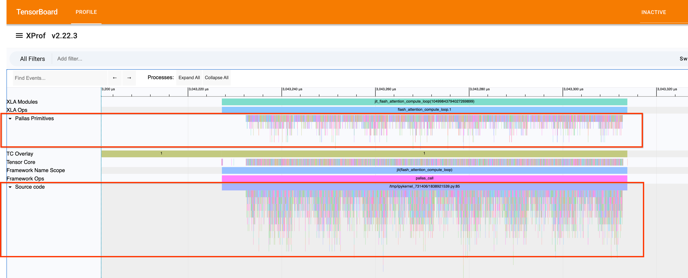
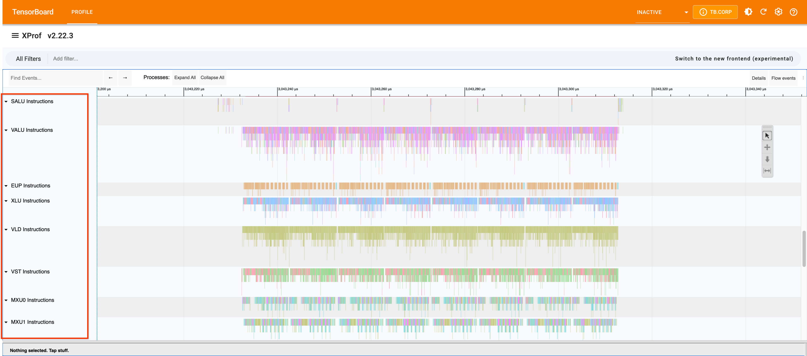
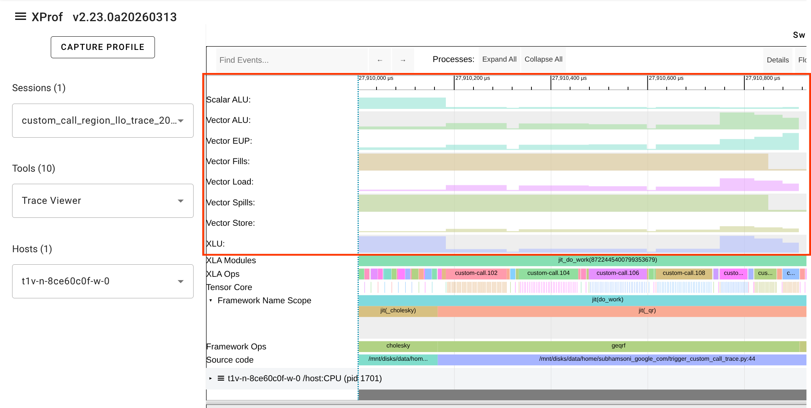

# Custom Call Profiling

XLA Custom Calls allow you to execute custom kernels or operations that are not
natively supported by XLA. To gain visibility into the performance of these
custom calls within the [Trace Viewer](trace_viewer.md), you can use specific
XLA flags to enable detailed tracing and LLO (Low-Level Optimizer) debug
information.

> ⚠️ **EXPERIMENTAL FEATURE**: Low Level Optimizer (LLO) analysis and custom
> call profiling are **experimental**. To access these features and all CLI
> analysis tools (`verify_numerical_parity`, `get_kernel_stats`,
> `get_llo_analysis`, `get_llo_debug_string`), **install `xprof-nightly`**.
> The standard `xprof` PyPI release (2.23.1) lacks these subcommands.

## Prerequisites & Toolchain Requirements

Before capturing LLO traces, verify that your environment meets the following
requirements:

*   **Python 3.11+ (Python 3.12 recommended)**: Default Cloud TPU VM images
    (Ubuntu 22.04) ship with system Python 3.10.12, which silently caps JAX at
    version 0.6.2 and pulls `libtpu` 0.0.17. Older `libtpu` builds lack LLO flag
    definitions, causing `ERROR: Unknown command line flag` or returning empty
    LLO profiles. Using `uv` to manage a Python 3.12 virtual environment is
    strongly recommended.
*   **Package Installation (`xprof-nightly`)**: Install `xprof-nightly`
    alongside `jax[tpu]`:
    ```bash
    # 1. Setup Python 3.12 environment
    pip install uv
    uv python install 3.12
    uv venv --python 3.12 ~/venvs/v312

    # 2. Install xprof-nightly and JAX
    uv pip install --python ~/venvs/v312/bin/python \
        'jax[tpu]>=0.11.0' xprof-nightly numpy ml_dtypes absl-py fire
    ```
*   **JAX >= 0.11.0**: Required for custom call LLO tracing support and matching
    `libtpu` runtime binaries (>= 0.0.46).
*   **Strict Environment Ordering**: `LIBTPU_INIT_ARGS` must be exported in the
    shell or configured in `os.environ` **strictly before `import jax`**.
    `libtpu` parses initialization flags upon the very first import of JAX;
    setting them after `import jax` silently has no effect without raising an
    exception.

## Hardware Compatibility Matrix

| Capability | Hardware Requirement | Notes |
| :--- | :--- | :--- |
| **LLO Analysis & Disassembly** (`get_llo_analysis`, `get_llo_debug_string`) | **Any supported TPU** (v6e, v5e, v4, etc.) | Fully supported on TPU v6e and v5e; **not** gated to v7x. |
| **Custom Call Tracing** (`--xla_xprof_enable_custom_call_tracing=true`) | **Any supported TPU** | Traces Pallas and custom kernel execution boundaries. |
| **Periodic Runtime Counters** (`tpu_enable_periodic_counter_sampling`) | **Ironwood TPU7x+ only** | Hardware performance counters require TPU v7x+. |

## Flag Availability Diagnostic

To verify that your installed `libtpu` binary contains the required flag
definitions before launching workloads, run this diagnostic snippet:

```python
import glob
import os
import libtpu

so_paths = glob.glob(os.path.dirname(libtpu.__file__) + "/*libtpu*.so")
if so_paths:
  blob = open(so_paths[0], "rb").read()
  for flag in (
      b"xla_xprof_register_llo_debug_info",
      b"xla_xprof_enable_custom_call_tracing",
      b"tpu_enable_periodic_counter_sampling",
  ):
    print(flag.decode(), "PRESENT" if flag in blob else "ABSENT")
```

## How to Enable Tracing

Set the following canonical XLA flags to compile and trace your workload with
LLO instrumentation:

*   `--xla_xprof_enable_custom_call_tracing=true`: Canonical flag that enables
    custom call tracing and automatically activates instruction bundle
    instrumentation.
*   `--xla_xprof_register_llo_debug_info=true`: Registers LLO debug
    information, opcodes, and metadata for XProf visualization.

```python
import os

# Flags MUST precede any jax / libtpu import
os.environ["LIBTPU_INIT_ARGS"] = (
    "--xla_xprof_enable_custom_call_tracing=true "
    "--xla_xprof_register_llo_debug_info=true"
)

import jax
# Workload definition and tracing...
```

### Example Trace Viewer

Here is an example of what the LLO traces look like in the Xprof Trace Viewer:




--------------------------------------------------------------------------------

### Advanced Parameters (Handling Event Drops)

If you see **event drops** or buffer overflows in Xprof, it means the trace
points are being triggered too frequently, overwhelming the hardware trace
buffers. You can tune the frequency of LLO trace insertion using advanced
parameters.

These parameters are configured via `xla_tpu_bundle_instrumentation_options`.
You can control how often traces are packed into instruction bundles.

#### Key Parameters:

*   **`trace_best_effort_frequency`** (Default: 10): The target interval (in
    bundles) for inserting opportunistic traces packed into existing bundles.
    The compiler will try to insert a trace this often but will **not** create
    new bundles for it.
*   **`trace_guaranteed_frequency`** (Default: 10): The maximum number of
    bundles allowed between two traces. This is a guarantee. Whenever we cannot
    satisfy this by packing traces into existing bundles, we will create a new
    bundle and place a trace there (by itself).

#### How to Tune:

*   **If you see Event Drops**: **Increase** the values (e.g., set to 50 or 100)
    to trace **less frequently**, reducing the volume of trace data generated.
*   **If you need finer granularity**: **Decrease** the values to trace more
    frequently (at the cost of higher overhead and potential buffer overflows).

--------------------------------------------------------------------------------

### How Instruction Cycle Counts are Calculated

Because trace points are injected opportunistically rather than at every single
instruction, intermediate timestamps are interpolated based on estimated
hardware cycle costs.

The compiler calculates the intrinsic hardware cycle cost of each LLO
instruction based on the target TPU generation and the Execution Unit resolving
it. These cycle counts represent execution throughput and latency delays.

#### High-Level Flow

1.  **Parse LLO Instruction**: Identify the Opcode and Metadata.
2.  **Get Base Hardware Cycles**: Determine cycles based on TPU Generation
    (v5e/v5p, v6e/v7x, etc.).
3.  **Convert to GTC Ticks**: Translate cycles to Global Timer Counter (GTC)
    ticks using formula: `Cycles * (GTC_Freq * 16) / TC_Freq`.
4.  **Create Timeline Span**: Interpolate intermediate events evenly between
    known trace boundaries.

#### Cycle Estimates by Unit and Generation

Below are examples of how base hardware cycles are modeled for different
execution units:

##### Matrix Multiply Unit (MXU)

The MXU cycle counts reflect throughput based on data type density.

Instruction Category | Sub-Type / Format                 | (v5e/v5p) | (v6e/v7x)
:------------------- | :-------------------------------- | :-------: | :-------:
**Vector Matmul**    | F32                               | 8         | 8
                     | Matmul Preprocessing (F8 to BF16) | 4         | 4
                     | Packed BF16                       | 2         | 2
                     | Integer Formats (U8, S8, U4, S4)  | 1         | 1
**Vector Latches**   | Transposed F32                    | 4         | 4
                     | Transposed BF16                   | 8         | 8
                     | Non-Transposed F32                | 2         | 2
                     | Non-Transposed BF16               | 4         | 4
**Matprep / Dwg**    | All                               | 1         | 1

##### Transpose Unit (XLU)

Cycle counts represent transpose memory layout and crossbar delays.

| Instruction Category   | Sub-Type / Format      | (v5e/v5p) | (v6e/v7x) |
| :--------------------- | :--------------------- | :-------: | :-------: |
| **Packed Transpose**   | All                    | 17        | 4         |
| **Standard Transpose** | B32 Transpose          | 9         | 4         |
|                        | B16 Transpose          | 17        | 4         |
:                        : (Segmented/Compressed) :           :           :

##### Execution Unit Pool (EUP)

EUP instructions represent vector math functions (e.g., `tanh`, `log`, `exp`).

Instruction Category                  | (v5e/v5p) | (v6e/v7x)
:------------------------------------ | :-------: | :-------:
**Vector Math** (`tanh`, `exp`, etc.) | 2         | 1

## Flag Migration & Reconciliation

Earlier versions of XLA and TPU documentation referenced the legacy flag
`--xla_enable_custom_call_region_trace=true`.

*   **Canonical Flag**: `--xla_xprof_enable_custom_call_tracing=true`
    (Recommended). This flag activates custom call tracing while automatically
    configuring the required instruction bundle instrumentation and trace
    frequencies (`xla_tpu_bundle_instrumentation_options`).
*   **Legacy Flag**: `--xla_enable_custom_call_region_trace=true` (Deprecated
    alias). While still supported by older compiler backends, users should
    migrate to `--xla_xprof_enable_custom_call_tracing=true`.

Example:

```bash
export LIBTPU_INIT_ARGS="--xla_xprof_enable_custom_call_tracing=true --xla_xprof_register_llo_debug_info=true"
python your_jax_workload.py
```

When these flags are enabled, a new **LLO utilization** line will appear in the
Trace Viewer for each TPU core or device executing the custom call.

### LLO Utilization Line

The **LLO utilization** line provides a visualization of how hardware resources
are used during the execution of a custom call. This is particularly useful for
identifying bottlenecks within custom kernels (e.g., those written in Pallas or
Mosaic).



*Note: The image above shows an example of the LLO utilization line in the Trace
Viewer.*

### Best Practices & Field Gotchas

-   **Use `xprof-nightly`**: Standard `xprof` 2.23.1 lacks `get_kernel_stats`,
    `verify_numerical_parity`, and LLO CLI subcommands. In non-Google3
    environments, always install `xprof-nightly`.
-   **Metrics Interpretation for Pallas Kernels (Roofline Blind Spot)**:
    XLA has no cost model for `tpu_custom_call`. Therefore,
    `get_roofline_model` and `get_overview` will report `0.0 GFLOP/s`,
    `"bound_by": "Unknown"`, and `0.0%` MXU utilization even when LLO
    instructions are fully captured and executing on hardware.
    *   For kernel duration and latency, use `xprof get_kernel_stats <logdir>`.
    *   For low-level instruction execution breakdown and cycle estimates, use
        `xprof get_llo_analysis <logdir>`.
-   **Lite Proto Inner Loop Bodies**: In `get_llo_debug_string`, inner loop
    bodies are summarized as `// Loop body not available in lite proto`. It
    provides the surrounding module structure, register allocation, and outer
    instruction sequence.
-   **Trace Validation Heuristic**: Do **not** check for trace line names like
    `SALU / VALU / EUP / XLU / VLD / VST / MXU Instructions` to determine if
    LLO data exists. Valid LLO traces do not use those line names. Validate LLO
    capture by executing `xprof get_llo_analysis <logdir>` and verifying
    `"success": true`.
-   **Capture Kernel Sizing**: Sizing test/capture kernels too large can trigger
    compiler errors such as `CompileTimeScopedVmemOom: Scoped allocation with
    size 32.81M and limit 32.00M exceeded scoped vmem limit`. Keep capture
    matrices conservatively sized (e.g. `(512, 512, 1024)` f32).
-   **Separate Virtual Environments**: When porting kernels across JAX
    versions (e.g., JAX 0.11+ deprecations such as `pltpu.repeat`), maintain
    dedicated virtual environments.
