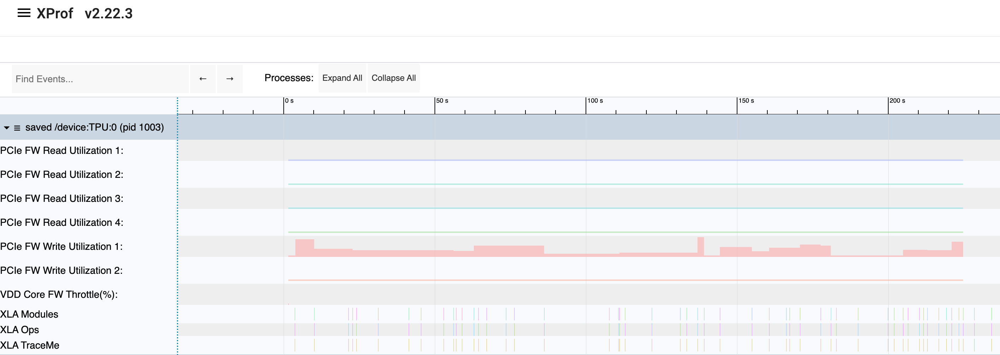
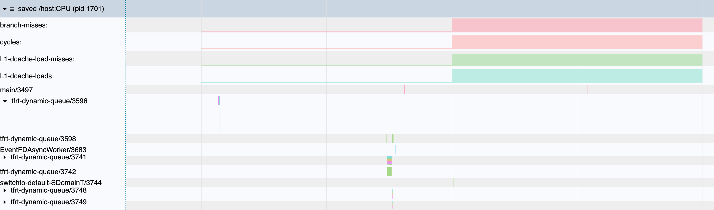

# DCN and PCIe Profiling

When troubleshooting performance in a distributed environment, Datacenter
Network (DCN) communication (between different host machines) and PCIe
communication (between a host CPU and its local TPU device) are closely
connected. Because network data from the DCN must be transferred to the TPU over
the local PCIe bus, network bottlenecks often manifest as PCIe congestion or
host CPU bottlenecks.

To analyze these bottlenecks holistically, you should collect performance
metrics from both the device (PCIe) and host CPU (DCN/PCIe driver/OS events)
perspectives.

## 1. Device-Side: FW PCIe Utilization Counters

To track local host-to-device transfers from the accelerator card's perspective
(available on TPU v6e and newer platforms), enable the device-side firmware PCIe
counters. This measures the amount of data the TPU's firmware reports
transferring over the PCIe bus.

To collect these metrics, ensure you collect the profile with the
`--tpu_enable_fw_pcie_utilization_event=true` flag.



## 2. Host-Side: Host Performance Counters

To see how the host machine is handling network and PCIe traffic, XProf can
collect Host Performance Counters (e.g., host-side CPU cache misses, memory
bandwidth, and standard OS metrics are available in
[perf-stat(1)](https://linux.die.net/man/1/perf-stat)).

Under the hood, XProf leverages Linux performance monitoring subsystem using two
key interfaces:

### (1) Custom Host-Side Events via `libpfm(3)`

The [`libpfm(3)`](https://man7.org/linux/man-pages/man3/libpfm.3.html) library
translates user-configured event strings (e.g., standard hardware counters or
specific network/PCIe driver events) into raw hardware/kernel performance
counter attributes. If you need to specify custom host-side DCN or PCIe events,
ensure your event strings are valid according to `libpfm` syntax.

Example of specifying custom host-side events:

```python
jax.profiler.start(
    # ... Some other flags...
    advanced_configuration={'tpu_cpu_perf_counter_profile_events': 'branch-misses,cycles,L1-dcache-load-misses,L1-dcache-loads'})
```



### (2) Raw Performance Attribute Configurations via `perf_event_open(2)`

For more advanced/raw event configurations (e.g., kernel-level multiplexing or
memory controllers):

The underlying
[`perf_event_open(2)`](https://man7.org/linux/man-pages/man2/perf_event_open.2.html)
system call is used by XProf to sample and count these host events.

To configure any `perf_event_open` attribute:

```python
jax.profiler.start(
    # ... Some other flags...
    advanced_configuration={'tpu_cpu_perf_counter_configs': '<config1>:<type1>:<name1>,<config2>:<type2>:<name2>'})
```

Where:

* `config` and `type` match the parameters of the `perf_event_attr` struct under
  [`perf_event_open(2)`](https://man7.org/linux/man-pages/man2/perf_event_open.2.html).
* `name` is a user-defined string display name for the Trace Viewer.

### CPU Performance Counter Sampling Interval

To configure the interval (in milliseconds) at which CPU performance counters
are collected, use:

```python
jax.profiler.start(
    # ... Some other flags...
    advanced_configuration={'tpu_cpu_perf_counter_interval_ms': <int_value>})
```

Adjust this value to balance sampling frequency against overhead. A smaller
interval gathers more frequent samples to capture fine-grained behavior within
short steps, while a larger interval prevents trace file bloat and CPU overhead
during long profiling runs. If `tpu_cpu_perf_counter_interval_ms` is not
specified, XProf falls back to its minimum supported sampling period of
**10 ms**.
