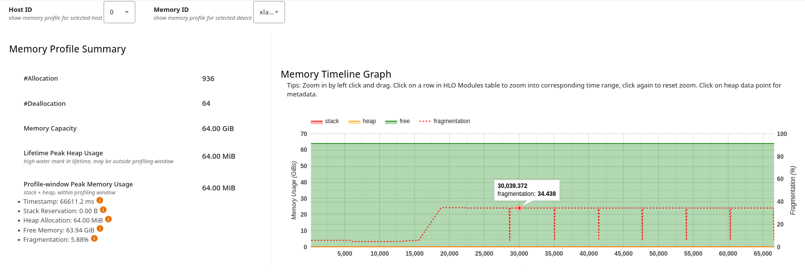

# Diagnosing Fragmentation

*Fragmentation* occurs when there is enough total free memory available, but it's not contiguous (i.e., it is split into
separate non-adjacent chunks). This means a large allocation request might fail even though the total free memory would
be sufficient if it were contiguous.

The fragmentation metric appears in two places in the [Memory Profile Tool](./memory_profile.md):

- **Memory Profile Summary:** Shows overall fragmentation statistics;
- **Memory Timeline Graph:** Shows how fragmentation changes over time.

A high fragmentation percentage indicates that free memory is scattered and not contiguous. In this case, even with
sufficient total free memory, large allocations may fail. This can lead to Out of Memory (OOM) errors.

## How to Detect Fragmentation Using the Memory Timeline View

The **Memory Timeline Graph** in the [Memory Profile](./memory_profile.md) tool shows fragmentation as a percentage.

You can also click on any point in the memory timeline graph to see more information about memory usage for that
timestamp. This information can help identify when fragmentation spikes occur.

To detect fragmentation, look for two specific visual cues:

* **The "Sawtooth" Pattern:** If you see memory usage rising and falling sharply, you likely have many short-lived
  objects being created and destroyed.
* **The "Swiss Cheese" Effect:** If the "Free Memory" bars are scattered in tiny slivers between "Active Memory" blocks,
  that is your fragmentation.

**Note:** The **Memory Profile** tool provides dynamic runtime information. This is different from the **Memory Viewer**
tool, which shows static, program-order based memory visualization from the XLA compiler.

## What to Do When Fragmentation is Identified

When you identify fragmentation issues in the Memory Timeline Graph, the appropriate action depends on the pattern you
observe:

1. **High fragmentation percentage that is constant over time:** If you see a consistently high fragmentation percentage
   throughout the timeline with minimal variation, this indicates a systemic issue with memory allocation patterns in
   your program. The fragmentation is likely caused by the interleaving of allocations and deallocations of different
   sizes during program execution. To address this, consider reorganizing your code to batch similar-sized allocations
   together, or restructure your program to reduce the mixing of temporary and long-lived allocations. You may also want
   to review your XLA compilation settings to optimize buffer assignment and memory reuse patterns.

2. **Low overall fragmentation with periodic spikes:** If the total fragmentation percentage is low but you observe
   sharp spikes at specific points in the timeline, this indicates that certain operations or phases of your computation
   are causing temporary fragmentation. Click on the spike points in the graph to identify which operations are running
   at those timestamps. Once identified, investigate whether these operations can be reordered, whether temporary
   buffers can be resized, or whether the allocation strategy for these specific operations can be optimized. These
   spikes may be acceptable if they don't coincide with large allocation requests, but they become problematic if a
   large allocation is attempted during a fragmentation spike.

The following are a non-exhaustive list of patterns you may want to consider when fixing fragmentation issues.

### Implement Memory Pooling & Pre-allocation

The most common cause of fragmentation is the constant allocation and deallocation of tensors during a loop.

* **Pre-allocate Buffers:** Instead of creating a new tensor inside a training loop, create a buffer of the maximum
  required size outside the loop and reuse it.
* **Use In-place Operations:** Whenever possible, use operations that modify existing tensors (e.g., `x.add_(y)` in
  PyTorch or `out=target` params in NumPy/JAX) rather than creating new ones.

### Optimize Model Architecture

Large, varied tensor sizes are the primary "fragmenters."

* **Standardize Input Shapes:** If you use dynamic input shapes (e.g., varying sequence lengths in NLP), every batch
  creates differently sized "holes" in the memory. **Padding** to a constant shape or using **bucketing** can keep
  allocation sizes consistent. Use `jnp.pad` or `tf.pad` to ensure all inputs to a `@jit` function are padded to a fixed
  power-of-two size. If you use JAX, mark structural parameters as `static_argnums` to ensure the layout remains
  consistent.
* Tune your batch sizes to be a power of 2 (e.g., 64, 128), as it often aligns better with memory page boundaries.

### Identify "Long-Lived" Buffer Interference

In XLA memory traces, look for small buffers that stay active for the entire duration of the profile. These are often
constants or global variables that were allocated early. If they are located in the middle of your memory space, they
prevent two large free blocks from merging (**coalescing**).

* **Initialize Large Buffers Before Training Loop:** Try to initialize your largest weights and buffers first, or use a
  "warm-up" iteration to allow the allocator to settle its layout before the heavy training loop begins.

### Analyze the HLO Memory Schedule

If fragmentation is still high, the issue might be the **XLA Compiler's Scheduling**. XLA decides when to release a
buffer based on when the last operation finishes using it.

* Check the **HLO Graph** in XProf. Look for "Live Range" lines that are unexpectedly long.
* If a large buffer is being held open because a tiny operation downstream needs it, consider refactoring that part of
  the model to allow the large buffer to be freed sooner.
* You can also manually call `gc.collect()` or empty the cache (e.g., `torch.cuda.empty_cache()`) during validation
  steps to force coalescing.

### Address Device-to-Host (D2H) Bottlenecks

Sometimes, fragmentation is exacerbated by "pinned memory" used for data transfer. If you see many small allocations
synchronized with data loading, ensure your data pipeline is using a separate, dedicated pool of memory so it doesn't
"poke holes" in the primary GPU compute heap.

**Tip:** If you are using JAX, you can use `jax.clear_caches()` between experimental runs. In TensorFlow,
`tf.keras.backend.clear_session()` helps, though it is less effective for XLA-specific fragmentation than restarting the
kernel.

### Manage the XLA Memory Allocator

The [**BFC (Best-Fit with Coalescing) Allocator**](https://github.com/openxla/xla/blob/1efbc8db1ad2bef0859e37ecec9704a9f6e80e19/xla/tsl/framework/bfc_allocator.h#L16)
tries to prevent fragmentation, but you can help it:

* **Adjust `GPU_MEM_FRACTION`:** Sometimes, letting the framework claim 100% of the memory upfront prevents the OS from
  interfering, allowing the BFC allocator to manage the entire space more efficiently.
* **Set `TF_FORCE_GPU_ALLOW_GROWTH=false`:** Setting this to `false` tells XLA to grab all available memory immediately.
  This prevents the OS or other processes from fragmenting the physical address space that XLA wants to manage as a
  single contiguous block.
* **Adjust `XLA_CLIENT_MEM_FRACTION`:** If you are using JAX, set this to a high value (e.g., `.90`). This reserves a
  massive block upfront, allowing the BFC allocator to manage the "Swiss cheese" internally rather than fighting the
  system for more segments.

### Summary Checklist for Fixing Fragmentation

| Action | Why it helps |
| :---- | :---- |
| **Pooling and Pre-allocation** | Prevents constant allocation and deallocation of tensors during a loop |
| **Standardize Input Shapes** | Keeps tensor sizes consistent, allowing the allocator to reuse the same "slots." |
| **Initialize Large Buffers** | Prevents long-lived, small buffers from hindering memory coalescing. |
| **Garbage Collection** | Manually call `gc.collect()` or empty the cache (e.g., `torch.cuda.empty_cache()`) during validation steps to force coalescing. |
| **Memory Mapping** | For very large datasets, use memory-mapped files to offload pressure from the primary heap. |
| **Batch Size Tuning** | A batch size that is a power of 2 (e.g., 64, 128) often aligns better with memory page boundaries. |
| **Manage the XLA Memory Allocator** | Use flags to help the BFC allocator to manage memory more efficiently. |
