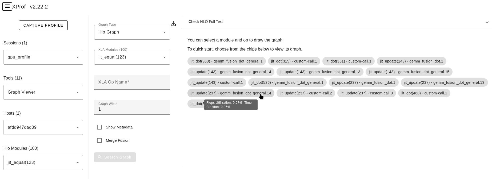
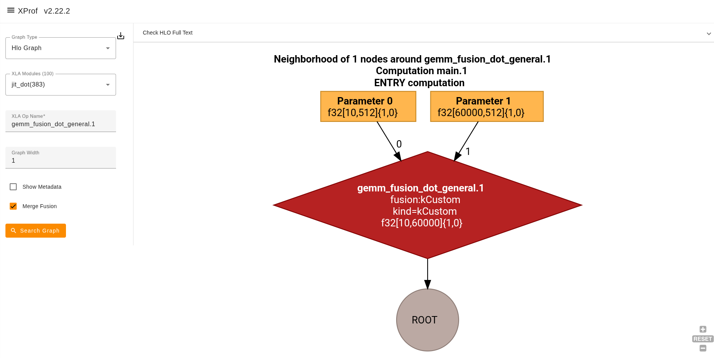
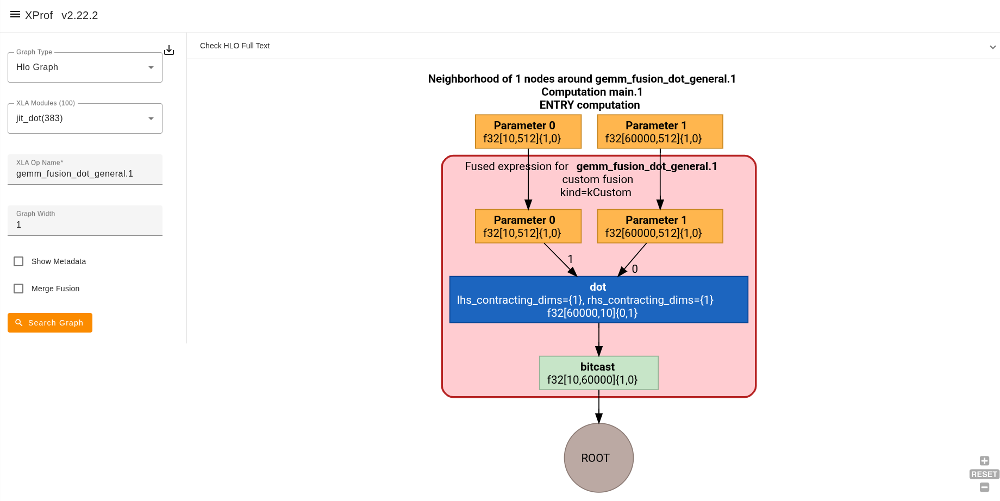

# Fusion Verification with Graph Viewer

This guide explains how to use the XProf Graph Viewer to verify that XLA has successfully fused operations, such as
convolution with activation functions.

## Why Fusion Matters

Operator fusion is an HLO compiler pass that combines multiple operations into a single computation kernel. It is a
critical optimization for performance on hardware accelerators since it reduces memory traffic and kernel launch
overhead.

In some situations, expected fusions may not occur due to operation patterns, data types, or compiler limitations. This
guide shows how to verify when fusion has succeeded and when it has not using the Graph Viewer.

## Step 1: Capture a Profile and Navigate to Graph Viewer

First, [capture your profile](./capturing_profiles.md) and open the Graph Viewer tool:

1. Launch XProf: `xprof --logdir=/tmp/<profile-data>` (replace `<profile-data>` with your actual profile directory);
2. Navigate to the profile in your browser;
3. Select **"Graph Viewer"** from the **Tools** dropdown.

## Step 2: Select the Module to Analyze

By default, no operations are selected in Graph Viewer, so you will see an empty screen. You need to Select the module
and Op to analyze by following the steps below:

1. **Select your main module:** Use the **XLA Modules** dropdown to select the primary computation module. Then, input
   an Op name to trigger a graph search.
2. **Check additional modules:** For workloads with multiple modules, analyze each one that contains operations you
   expect to be fused.
3. **Quick Start Alternative:** Instead of using the dropdown, you can directly click an XLA Op chip to begin your
   analysis immediately.



An alternative way to access Graph Viewer is starting from other tools. These include:

- [HLO Op Profile](./hlo_op_profile.md) to identify the most time consuming op
- [Trace Viewer](./trace_viewer.md) to identify the cause of a pipeline bubble
- [Memory Viewer](./memory_viewer.md) to see the HLO Ops at Peak Memory Allocation Time

Clicking the op in those tools will give you a direct link into the same op within Graph Viewer.

## Step 3: Understanding the Merge Fusion Checkbox

The **Merge Fusion** checkbox controls how fusion nodes are displayed:

- Merge Fusion unchecked (default):
  - Fusion nodes expand to show all contained operations;
  - Displays the full subgraph of fused operations;
  - Shows data flow between operations inside the fusion;
  - **Best for**: Verifying what operations are actually fused together.
- Merge Fusion checked:
  - Fusion nodes appear as single collapsed boxes;
  - Shows fusion kind label (e.g., "loop fusion", "input fusion");
  - Hides the internal operations within the fusion;
  - **Best for**: Getting a high-level view of the graph structure.




To toggle between modes, check/uncheck the box and click **"Search Graph"** again to refresh.

## Step 4: Identify Fusion Opportunities

### Search for Target Operations

Use the **XLA Op Name** box to search for operations you expect to be fused:

1. **Type the operation name** (e.g., `convolution`, `dot`, `add`);
2. **Press Enter** to center the graph on that operation;
3. Set **Graph Width** to 2-3 to see neighboring operations.

### Look for Fusion Nodes

Fused operations are indicated by:

1. **Fusion node boxes**: Look for nodes labeled with "fusion" in their name
2. **Fusion kind annotations**:
   - `kLoop`: Loop fusion (most common, for element-wise ops)
   - `kInput`: Input fusion (for reduction operations)
   - `kOutput`: Output fusion (less common)
   - `kCustom`: Custom fusions (e.g., cuDNN fused convolutions)

## Step 5: Using Graph Viewer Features for Fusion Analysis

Hover over the node you want to inspect, and the left panel will show the expression details, such as the average total
time spent in the fusion, FLOPS and HBM bandwidth utilization, the XLA expression of the fusion and the Long Op Name.

### Download HLO Text Representation for the Selected Module

For detailed analysis:

1. Click **"Check HLO Full Text"** at the top;
2. Choose "Short Text" or "Long Text";
3. Search for fusion boundaries in the text.

## Step 6: Detecting Unsuccessful Fusion Operations

- **Visual indicators in Graph Viewer:** With **Merge Fusion unchecked**, operations that should be fused together
  appear as separate, distinct nodes instead of being within the same fusion boundary.

- **Using HLO text to detect unfused operations:**

  1. Click **"Check the HLO Full Text"** in Graph Viewer;
  2. Save or search the text representation;
  3. Look for these patterns:

    - **Unfused pattern - operations as separate instructions:**

    ```
    %convolution.1 = f32[1,224,224,64] convolution(...)
    %constant.0 = f32[] constant(0)
    %broadcast.1 = f32[1,224,224,64] broadcast(%constant.0)
    %maximum.2 = f32[1,224,224,64] maximum(%convolution.1, %broadcast.1)
    ```

    - **Fused pattern - operations inside fusion computation:**

    ```
    %fusion.1 = f32[1,224,224,64] fusion(%param0, %param1),
    kind=kLoop, calls=%fused_computation.1

    %fused_computation.1 {
    %p0 = f32[1,224,224,64] parameter(0)
    %p1 = f32[5,5,3,64] parameter(1)
    %conv = f32[1,224,224,64] convolution(%p0, %p1)
    %zero = f32[] constant(0)
    %bcast = f32[1,224,224,64] broadcast(%zero)
    ROOT %relu = f32[1,224,224,64] maximum(%conv, %bcast)
    }
    ```

- **Cross-reference with HLO Op Profile**: Use the [HLO Op Profile](./hlo_op_profile.md) tool to check if the operation
  is categorized as a fusion. If it is not, it indicates that fusion did not occur.

  1. Open HLO Op Profile tool;
  2. In the **Group by** dropdown, select **"Category"** (or keep it as **"Program"** to view it per-module);
  3. Locate your operation under the **HLO Op Name** column:
     - **If grouped by Category:** Check if it's under **"convolution fusion"** (fusion succeeded) or **"convolution"**
       (no fusion occurred) directly in the top-level list.
     - **If grouped by Program:** Expand your main module first, then look for the category row under it.
  4. Expand fusion nodes to see contained operations.
