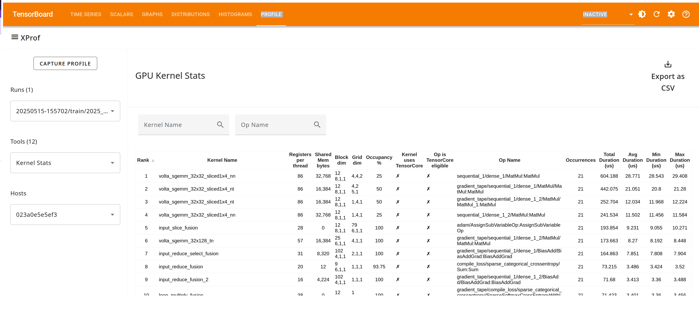

## GPU Kernel Stats tool

You can use the GPU Kernel Stats tool to visualize performance statistics and the originating op for every GPU accelerated kernel.

### Supported Platforms

The GPU Kernel Stats tool is supported on GPUs.

### GPU Kernel Stats Tool Components

The GPU Kernel Stats tool has the following key components:
*   GPU Kernel Statistics Table: This is the primary component, presenting a
    detailed breakdown of every GPU kernel executed during the profiling session in a tabular format. There is one row for each distinct GPU kernel, and columns that capture various details regarding that kernel.
    * Search boxes let you filter rows by GPU Kernel Name or by Op Name.
    * You can export the table to a CSV file by clicking the "Export as CSV" button.
