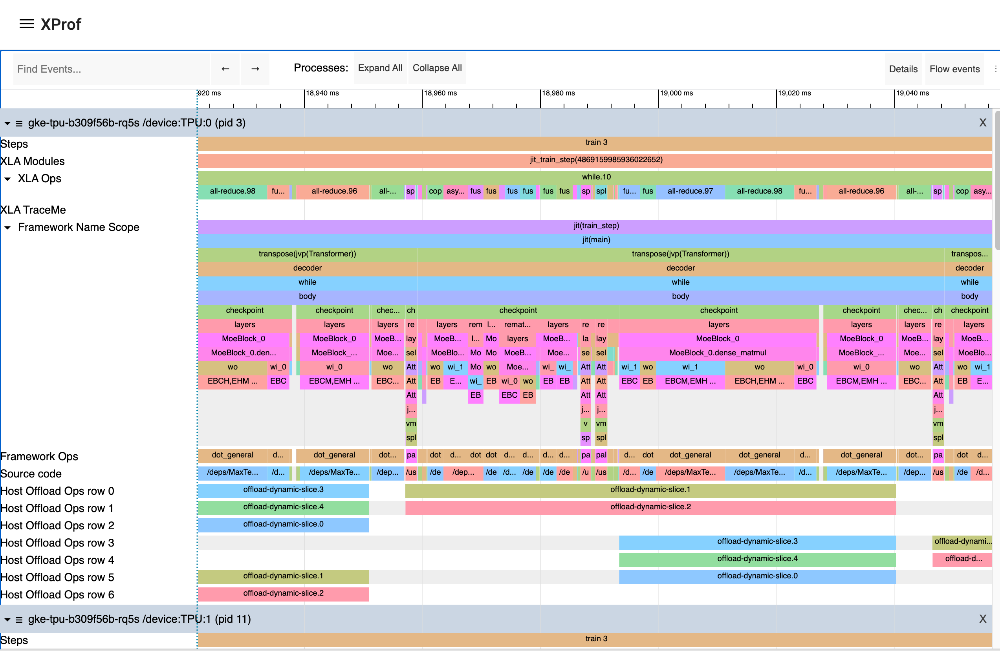

# Profiling JAX computations with XProf

XProf is a great way to acquire and visualize performance traces and profiles of
your program, including activity on GPU and TPU. The end result looks something
like this:



## Programmatic capture

You can instrument your code to capture a profiler trace for JAX code via the
[`jax.profiler.start_trace`](https://docs.jax.dev/en/latest/_autosummary/jax.profiler.start_trace.html#jax.profiler.start_trace)
and [`jax.profiler.stop_trace`](https://docs.jax.dev/en/latest/_autosummary/jax.profiler.stop_trace.html#jax.profiler.stop_trace)
methods. Call
[`jax.profiler.start_trace`](https://docs.jax.dev/en/latest/_autosummary/jax.profiler.start_trace.html#jax.profiler.start_trace)
with the directory to write trace files to. This should be the same `--logdir`
directory used to start XProf. Then, you can XProf to view the traces.

For example, to take a profiler trace:

```python
import jax

jax.profiler.start_trace("/tmp/profile-data")

# Run the operations to be profiled
key = jax.random.key(0)
x = jax.random.normal(key, (5000, 5000))
y = x @ x
y.block_until_ready()

jax.profiler.stop_trace()
```

Note the [`jax.block_until_ready`](https://docs.jax.dev/en/latest/_autosummary/jax.block_until_ready.html#jax.block_until_ready)
call. We use this to make sure on-device execution is captured by the trace. See
[Asynchronous dispatch](https://docs.jax.dev/en/latest/async_dispatch.html) for
details on why this is necessary.

You can also use the
[`jax.profiler.trace`](https://docs.jax.dev/en/latest/_autosummary/jax.profiler.trace.html#jax.profiler.trace)
context manager as an alternative to `start_trace` and `stop_trace`:

```python
import jax

with jax.profiler.trace("/tmp/profile-data"):
  key = jax.random.key(0)
  x = jax.random.normal(key, (5000, 5000))
  y = x @ x
  y.block_until_ready()
```

## Viewing the trace

After capturing a trace, you can view it using the XProf UI.

You can launch the profiler UI directly using the standalone XProf command by
pointing it to your log directory:

```shell
$ xprof --port=8791 /tmp/profile-data
Attempting to start XProf server:
  Log Directory: /tmp/profile-data
  Port: 8791
  Worker Service Address: 0.0.0.0:50051
  Hide Capture Button: False
XProf at http://localhost:8791/ (Press CTRL+C to quit)
```

Navigate to the provided URL (e.g., `http://localhost:8791/`) in your browser
to view the profile.

Available traces appear in the "Sessions" dropdown menu on the left. Select the
session you're interested in, and then under the "Tools" dropdown, select
"Trace Viewer". You should now see a timeline of the execution. You can use the
WASD keys to navigate the trace, and click or drag to select events for more
details. See [the Trace Viewer Tool documentation](trace_viewer.md) for more
details on using the trace viewer.

## Manual capture via XProf

The following are instructions for capturing a manually-triggered N-second trace
from a running program.

1. Start an XProf server:

    ```shell
    xprof --logdir /tmp/profile-data/
    ```

    You should be able to load XProf at `<http://localhost:8791/>`. You can
    specify a different port with the `--port` flag.

1. In the Python program or process you'd like to profile, add the following
   somewhere near the beginning:

   ```python
   import jax.profiler
   jax.profiler.start_server(9999)
   ```

    This starts the profiler server that XProf connects to. The profiler
    server must be running before you move on to the next step. When you're done
    using the server, you can call `jax.profiler.stop_server()` to shut it down.

    If you'd like to profile a snippet of a long-running program (e.g. a long
    training loop), you can put this at the beginning of the program and start
    your program as usual. If you'd like to profile a short program (e.g. a
    microbenchmark), one option is to start the profiler server in an IPython
    shell, and run the short program with `%run` after starting the capture in
    the next step. Another option is to start the profiler server at the
    beginning of the program and use `time.sleep()` to give you enough time to
    start the capture.

1. Open `<http://localhost:8791/>`, and click the "CAPTURE PROFILE" button
   in the upper left. Enter "localhost:9999" as the profile service URL (this is
   the address of the profiler server you started in the previous step). Enter
   the number of milliseconds you'd like to profile for, and click "CAPTURE".

1. If the code you'd like to profile isn't already running (e.g. if you started
   the profiler server in a Python shell), run it while the capture is
   running.

1. After the capture finishes, XProf should automatically refresh. (Not
   all of the XProf profiling features are hooked up with JAX, so it may
   initially look like nothing was captured.) On the left under "Tools", select
   "Trace Viewer".

You should now see a timeline of the execution. You can use the WASD keys to
navigate the trace, and click or drag to select events to see more details at
the bottom. See [the Trace Viewer Tool documentation](https://openxla.org/xprof/trace_viewer)
for more details on using the trace viewer.

## XProf and Tensorboard

XProf is the underlying tool that powers the profiling and trace capturing
functionality in Tensorboard. As long as `xprof` is installed, a "Profile" tab
will be present within Tensorboard. Using this is identical to launching XProf
independently, as long as it is launched pointing to the same log directory.
This includes profile capture, analysis, and viewing functionality. XProf
supplants the `tensorboard_plugin_profile` functionality that was previously
recommended.

```shell
$ tensorboard --logdir=/tmp/profile-data
[...]
Serving TensorBoard on localhost; to expose to the network, use a proxy or pass --bind_all
TensorBoard 2.19.0 at http://localhost:6006/ (Press CTRL+C to quit)
```

## Adding custom trace events

By default, the events in the trace viewer are mostly low-level internal JAX
functions. You can add your own events and functions by using
[`jax.profiler.TraceAnnotation`](https://docs.jax.dev/en/latest/_autosummary/jax.profiler.TraceAnnotation.html)
and [`jax.profiler.annotate_function`](https://docs.jax.dev/en/latest/_autosummary/jax.profiler.annotate_function.html)
in your code.

## Configuring profiler options

The `start_trace` method accepts an optional `profiler_options` parameter, which
allows for fine-grained control over the profiler's behavior. This parameter
should be an instance of `jax.profiler.ProfileOptions`.

For example, to disable all python and host traces:

```python
import jax

options = jax.profiler.ProfileOptions()
options.python_tracer_level = 0
options.host_tracer_level = 0
jax.profiler.start_trace("/tmp/profile-data", profiler_options=options)

# Run the operations to be profiled
key = jax.random.key(0)
x = jax.random.normal(key, (5000, 5000))
y = x @ x
y.block_until_ready()

jax.profiler.stop_trace()
```

### General options

1. `host_tracer_level`: Sets the trace level for host-side activities.

   Supported Values:

   - `0`: Disables host (CPU) tracing entirely.
   - `1`: Enables tracing of only user-instrumented TraceMe events.
   - `2`: Includes level 1 traces plus high-level program execution details like
     expensive XLA operations (default).
   - `3`: Includes level 2 traces plus more verbose, low-level program execution
     details such as cheap XLA operations.

2. `device_tracer_level`: Controls whether device tracing is enabled.

   Supported Values:

   - `0`: Disables device tracing.
   - `1`: Enables device tracing (default).

3. `python_tracer_level`: Controls whether Python tracing is enabled.

   Supported Values:

   - `0`: Disables Python function call tracing (default).
   - `1`: Enables Python tracing.

### Advanced configuration options

#### TPU options

1. `tpu_trace_mode`: Specifies the mode for TPU tracing.

   Supported Values:

   - `TRACE_ONLY_HOST`: This means only host-side (CPU) activities are traced,
     and no device (TPU/GPU) traces are collected.
   - `TRACE_ONLY_XLA`: This means only XLA-level operations on the device are
     traced.
   - `TRACE_COMPUTE`: This traces compute operations on the device.
   - `TRACE_COMPUTE_AND_SYNC`: This traces both compute operations and
     synchronization events on the device.

   If "tpu_trace_mode" is not provided the trace_mode defaults to
   `TRACE_ONLY_XLA`.

2. `tpu_num_sparse_cores_to_trace`: Specifies the number of sparse cores to
   trace on the TPU.
3. `tpu_num_sparse_core_tiles_to_trace`: Specifies the number of tiles within
   each sparse core to trace on the TPU.
4. `tpu_num_chips_to_profile_per_task`: Specifies the number of TPU chips to
   profile per task.

#### GPU options

The following options are available for GPU profiling:

- `gpu_max_callback_api_events`: Sets the maximum number of events collected by
  the CUPTI callback API. Defaults to `2*1024*1024`.
- `gpu_max_activity_api_events`: Sets the maximum number of events collected by
  the CUPTI activity API. Defaults to `2*1024*1024`.
- `gpu_max_annotation_strings`: Sets the maximum number of annotation strings
  that can be collected. Defaults to `1024*1024`.
- `gpu_enable_nvtx_tracking`: Enables NVTX tracking in CUPTI. Defaults to
  `False`.
- `gpu_enable_cupti_activity_graph_trace`: Enables CUPTI activity graph tracing
  for CUDA graphs. Defaults to `False`.
- `gpu_pm_sample_counters`: A comma-separated string of GPU Performance
  Monitoring metrics to collect using CUPTI's PM sampling feature (e.g.
  `"sm__cycles_active.avg.pct_of_peak_sustained_elapsed"`). PM sampling is
  disabled by default. For available metrics, see
  [NVIDIA's CUPTI documentation](https://docs.nvidia.com/cupti/main/main.html#metrics-table).
- `gpu_pm_sample_interval_us`: Sets the sampling interval in microseconds for
  CUPTI PM sampling. Defaults to `500`.
- `gpu_pm_sample_buffer_size_per_gpu_mb`: Sets the system memory buffer size per
  device in MB for CUPTI PM sampling. Defaults to 64MB. The maximum supported
  value is 4GB.
- `gpu_num_chips_to_profile_per_task`: Specifies the number of GPU devices to
  profile per task. If not specified, set to 0, or set to an invalid value, all
  available GPUs will be profiled. This can be used to decrease the trace
  collection size.
- `gpu_dump_graph_node_mapping`: If enabled, dumps CUDA graph node mapping
  information into the trace. Defaults to `False`.

For example:

```
options = ProfileOptions()
options.advanced_configuration = {"tpu_trace_mode" : "TRACE_ONLY_HOST", "tpu_num_sparse_cores_to_trace" : 2}
```

Returns `InvalidArgumentError` if any unrecognized keys or option values are
found.
