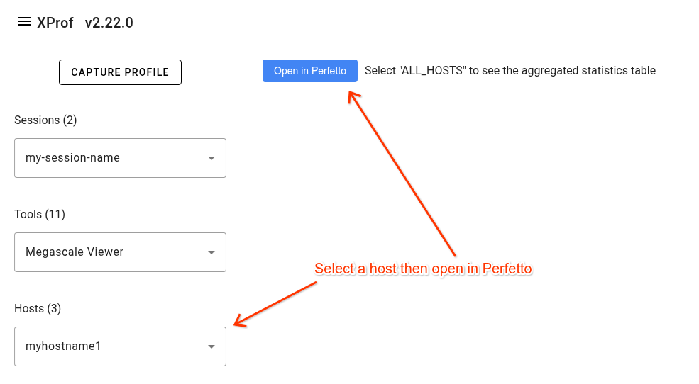
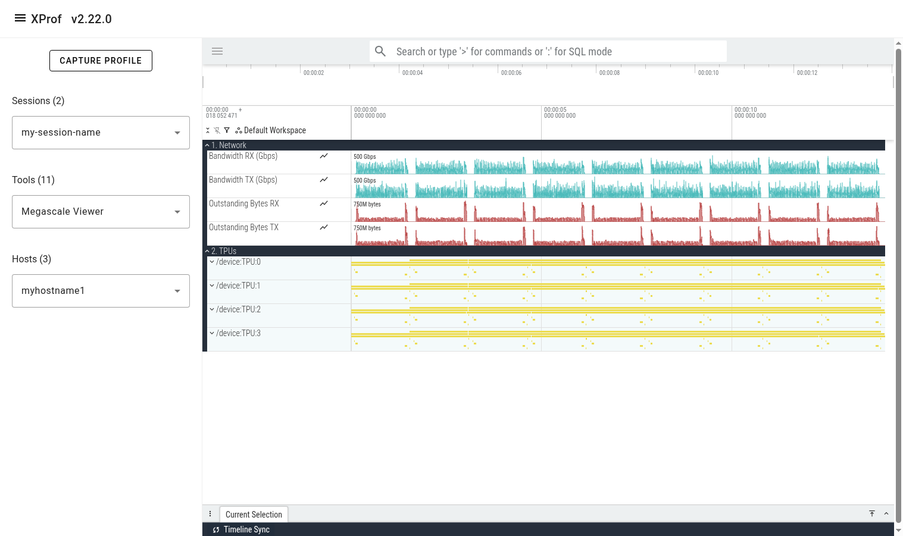
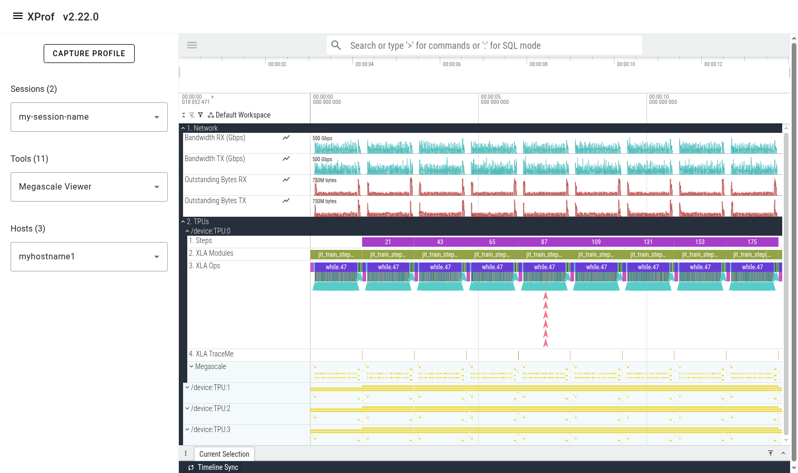
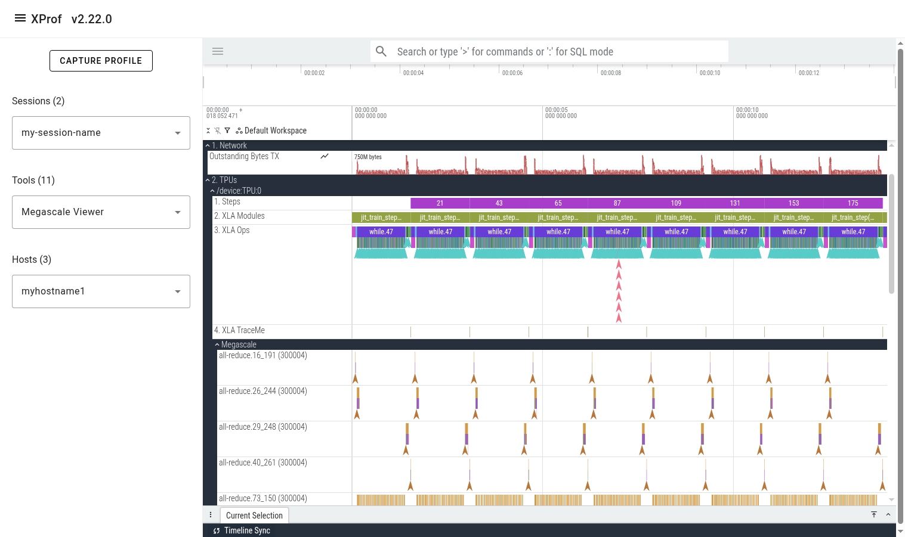
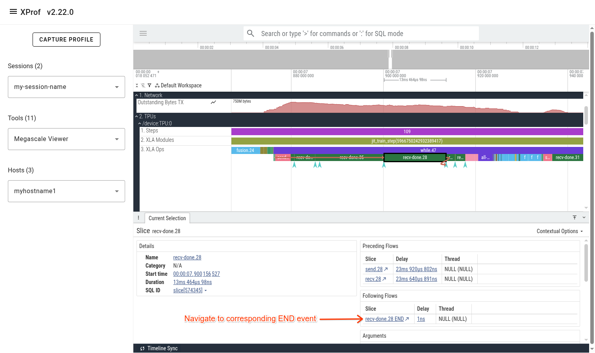
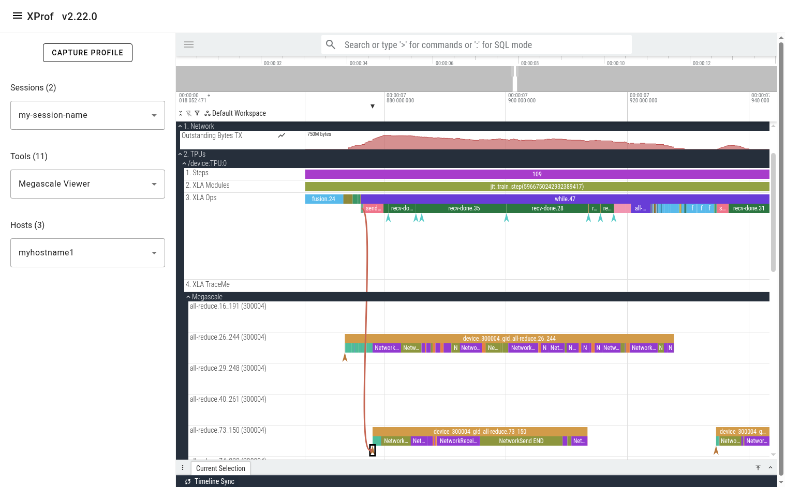
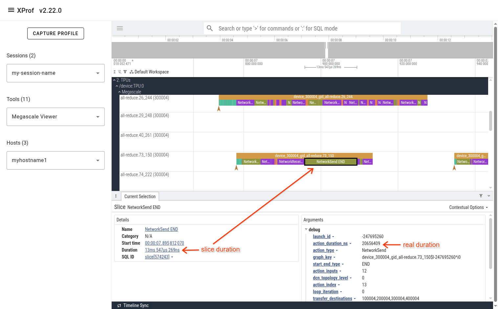
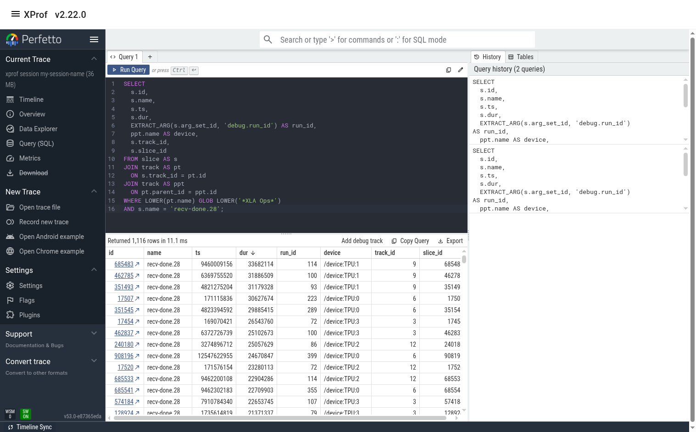
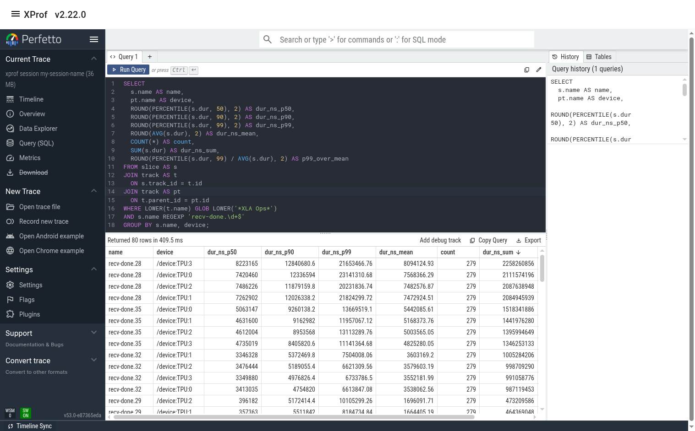
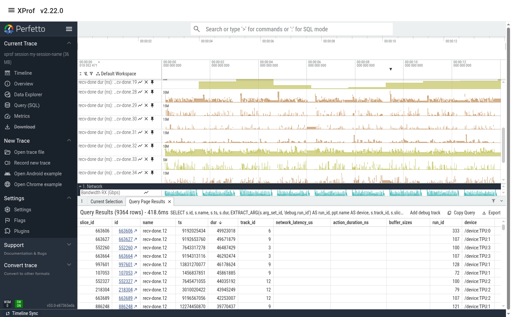

# Megascale Viewer

The Megascale Viewer tool helps understand and troubleshoot complex performance
issues in multi-slice workloads that utilize MegascaleXLA. It provides
visibility to relevant metrics such as network utilization, network latency, and
TPU stall time. It also allows the user to get a deeper understanding of the
performance of individual instances of megascale collectives by showing the
dependencies between events occurring on the TPU and the host.

**Note:** The documentation for the older "Megascale Stats" tool (which will be
deprecated in the near future) is [here](megascale_stats.md).

## Accessing the Tool

To access the tool, open a profile in xprof then navigate to the 'Megascale
Viewer' item in the 'Tools' drop down list in the left side bar. Select a host
in the 'Hosts' drop down list then click the 'Open in Perfetto' button.

## Trace Layout

Once the tool finishes loading the trace, you’ll see a 'Global Counters' section
containing several counter lines (e.g. network utilization). These counters are
aggregated across all megascale collectives across all profiled TPUs on the
selected host. Below it, you’ll see a 'TPUs' section showing all the TPUs.

Expanding one of the TPU sections reveals several lines showing different
classes of events on that TPU. The lines are:

*   **Steps**: shows training steps (as tracked by xprof)
*   **XLA Modules**: Shows all executions/runs of all XLA programs that ran
    during the profiled period.
*   **XLA Ops**: Shows all XLA ops (and custom kernels) that run on the TPU.
*   **XLA TraceMe**: Shows synchronization events. (e.g. barrier-cores)
*   **Megascale**: This is a parent track which contains a child track per
    unique Megascale collective.

Expanding the Megascale parent track reveals many children tracks; one per
megascale collective. The name of each track is the megascale collective’s name.
The number in brackets is the local TPU’s megascale device\_id, which is a
combination of the slice ID and the logical TPU ID. The events that appear in
this track represent this megascale collective’s action graph. These events help
understand the time attributed to network and host processing and how it
contributes to recv-done or send-done stall times.

## Connecting TPU Ops to Megascale Action Graph

When looking at a slow megascale TPU op (e.g. recv-done), a common next step is
to navigate to its respective megascale action graph execution. This can be done
by clicking on the recv-done of interest, then clicking on its corresponding
“recv-done END” event in the bottom panel in Perfetto UI.

**Note:** The “recv-done END” is not a real event that occurs on the TPU. It is
a synthetic event that is created in post-processing to make the flow events
work correctly in Perfetto UI.

After clicking the “END” event, you’ll see a flow arrow in the UI showing the
megascale graph execution that unblocks the selected recv-done.

You can also click on the “DeviceToHost START” instant event at the beginning of
the action graph line to see the corresponding “send” op on the TPU.

The events on Megascale tracks are collapsed such that only one is displayed at
any given point in time. This is done to avoid showing all active actions
simultaneously, reducing clutter. At any point in time, there are several
actions that are in-progress. The action that is displayed on this collapsed
line is the one that finishes first. To get additional information (e.g. the
real start time of an event, network latency, peer device IDs), refer to the
event’s arguments in the bottom panel in Perfetto UI.

In the pictured example above, we can see that the “NetworkSend END” event is
displayed in the UI as a 13.5 millisecond slice. The real duration of this
action is in the “action\_duration\_ns” event argument, which is 20.6
milliseconds.

## Viewing Statistics and Finding Interesting Events

The Perfetto UI allows querying events using PerfettoSQL. This allows users to
produce useful stats and helps find interesting events. (e.g. outliers)

**Note:** We're working on adding these as UI macros in the near future. This
will make this workflow faster and easier.

PerfettoSQL queries can be entered in the 'Query (SQL)' page in the left panel
of the Perfetto UI. The example query below shows all instances of
`recv-done.28` op. The UI is then used to list them in order of descending
duration.

The user can switch to the 'Timeline' tab to see the query results below the
timeline. If the query result contains slice ids, clicking on the id will jump
to the slice in the timeline.

### Sample Queries

Some useful sample queries can be found [here](megascale_viewer_sql.md).

## Example User Journey

Let’s assume we want to find which recv-done appears to have the biggest
contribution to overall step time. We can do this by using the
[recv-done stats](megascale_viewer_sql.md#recv-done-stats) query and sorting the
output by ‘duration\_ns\_sum’.

In this example, we see that recv-done.28 has the biggest contribution (~2.2
seconds out of the total profile duration of ~ 14 seconds). We also see that the
tail/p99 duration for this op is significantly higher than the median and the
mean. This implies that there may be room for improvement.

### (Optional) Plot recv-done Latency

Sometimes it also helps to look at a line graph of the duration over time. We
can do this by using the “recv-done ops” query then using Perfetto’s “Add debug
track” feature to add tracks of type “counter”.

The output is below. We can see that recv-done.28 indeed has much higher
duration at certain times (usually at the beginning or end of a training step).
We see that many of the other recv-done ops also have high variance.

### Find Slow Instances of a recv-done

Let’s find a slow instance of this op by modifying the “recv-done ops” query to
only focus on recv-done.28.

Here, we can sort the output by any column then click on the link in the “id”
column to jump to this event in the timeline view. In this case, the slowest
event happens to be on TPU 1.

At this point, you can either manually zoom in to the event (using the mouse or
the keyboard’s WASD keys), or you can hit the “F” key on the keyboard to jump to
that op and fully zoom in to it.

From here, you can examine the network lines (perhaps the network utilization
was maxed out when this op ran?). You can also jump to this op’s megascale graph
by clicking on the ‘recv-done END’ arrow as shown in the previous section.

**Tip:** Perfetto UI allows pinning multiple lines to the top. If the lines
you’re interested in are far away from each other, pin them so that they’re all
placed near each other at the top of the screen. The pin icon appears when you
hover the mouse near the track’s name.

### Use the Megascale Action Graph to Understand Latency

You can look at the events in the megascale graph to better understand why the
recv-done took so long. In this case, one potential issue is that the network
latency for some of the incoming transfers was high. For example, the last
NetworkReceive took 27 milliseconds to transfer 3.5 MiBs, which is too long.

Note that the duration of the "NetworkReceive END" slice is 11ms 36us. This
duration is essentially meaningless and is an artifact of the way we display
Megascale actions in one line. The real duration of the action
(action\_duration\_ns) is 47.2 milliseconds. The network latency accounts for 27
milliseconds of that.

