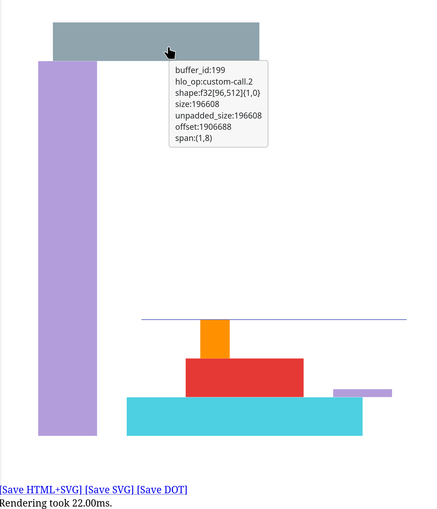
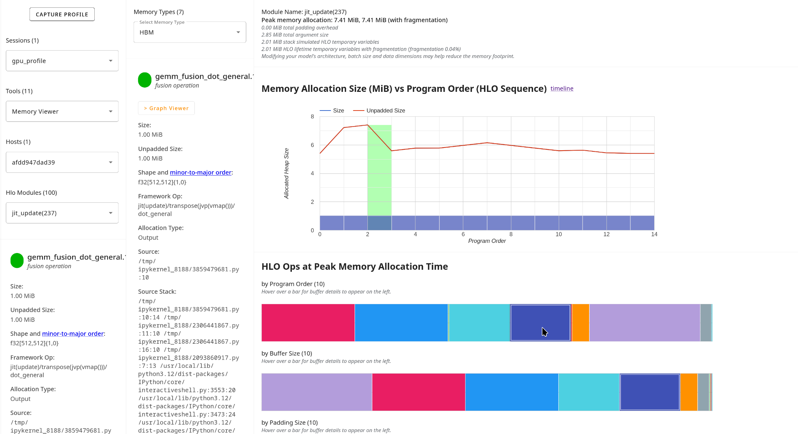

# Tracking Tensor Lifetimes and Identifying Memory Leaks

This guide describes how to use XProf tools to track tensor lifetimes and
identify tensors or buffers that are not being freed correctly, which can lead
to memory leaks or out-of-memory (OOM) errors.

## Overview

XProf provides several complementary tools for analyzing memory allocation and
deallocation patterns:

-   **Memory Profile**: Dynamic runtime view of memory allocations and
    deallocations over time, including a Memory Breakdown Table;
-   **Memory Viewer**: Static, compiler-based view of buffer allocations in
    program order;
-   **Trace Viewer**: Timeline visualization showing operation execution and
    dependencies.

Start by
[capturing your profile](./capturing_profiles.md#framework-specific_instructions).

## Analyze Memory Timeline With Memory Profile

Open the Memory Profile tool to get a dynamic view of allocations and
deallocations. Make sure you choose the appropriate Memory ID (usually HBM for
GPU/TPU).

1.  **Examine the Memory Timeline Graph**:

    -   **Increasing memory usage**: Look for upward trends in heap usage
        (orange) that never decrease, as they may indicate memory leaks.
    -   **Missing deallocations**: If memory grows continuously across steps,
        deallocations may not be happening.
    -   **Fragmentation spikes**: High fragmentation can indicate inefficient
        memory management. Check
        [Diagnosing Fragmentation](./diagnosing_fragmentation.md) for more
        information.

2.  **Check the Memory Profile Summary**: The total number of allocations vs.
    deallocations should be roughly balanced. If the number of allocations is
    higher than the number of deallocations during the profiling window, tensors
    are accumulating in memory.

The Memory Breakdown Table, at the bottom of the Memory Profile tool interface,
shows which framework operations contribute most to memory usage at peak, and
can also be used to identify OOM errors or memory leaks.

## Track Individual Buffer Lifetimes With Memory Viewer

Use Memory Viewer for a detailed static analysis of buffer lifetimes.

1.  Choose the **Memory Viewer** tool and select the HLO module you want to
    analyze from the dropdown.
2.  Examine the **Memory Allocation Timeline:** click the "timeline" link next
    to "Memory Allocation Size (MiB) vs Program Order (HLO Sequence)". This will
    bring up a visualization of the memory allocations, with a series of colored
    boxes, one per allocation.

    *   Each colored block represents one allocation;
    *   The width of each block represents the lifetime in program order;
    *   The height of each block represents the size of the allocation;
    *   The vertical placement of each block represents its starting memory
        address (offset).

    Look for blocks that span the entire program, which means they were never
    deallocated. You can hover over the blocks for more information about the
    HLO operation being represented.

    

3.  Inspect the **Buffer Charts** on the Memory Viewer tool to Identify
    long-lived allocations. After selecting the HLO Module you want to inspect,
    navigate to the “HLO Ops at Peak Memory Allocation Time” section of the
    tool. Hover over individual buffers in the buffer charts to see more
    information about the operation represented. If available, the overlay on
    the line chart shows allocation and deallocation points. Buffers that never
    deallocate will have bars extending to the end.

    

## Related: Trace Viewer WASM heap ownership (frontend)

This guide focuses on **model** tensor and buffer lifetimes in captured
profiles. Separately, Trace Viewer v2 allocates temporary buffers on the
WebAssembly heap when transferring compressed or binary trace payloads from
JavaScript into native code. Those allocations must be paired with `_free`
(or an always-free helper) so the browser tab does not grow without bound
during large trace loads or search.

Verified free conventions and helpers live at:

- [`frontend/app/components/trace_viewer_v2/wasm_string_utils.ts`](../frontend/app/components/trace_viewer_v2/wasm_string_utils.ts)
  (lands with the WASM string free conventions change; path relative to the
  repository root)

Prefer `withWasmHeapBuffer` / `withWasmCString` / `freeWasmPtr` from that
module at new call sites rather than raw `_malloc` / `_free` pairs.
