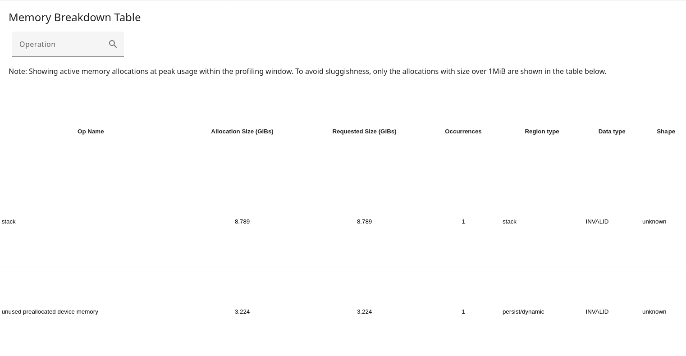

## Memory Profile Tool

You can use Memory Profile to visualize the memory usage over time of your
accelerators.

### Supported Platforms

Both TPU and GPU are supported.

### Using the Memory Profile Tool

Memory Profile has the following components:

*   The Memory ID selector at the top of the page lets you focus on the High
    Bandwidth Memory (HBM) attached to one of the different accelerators that
    may be connected to the host being profiled, or even the host memory in
    certain cases.
*   The “Memory Timeline Graph” and the “Memory Profile Summary” capture
    high-level information about memory allocations, deallocations, and usage
    during the profiling session, including breakdowns across stack and heap,
    and any impact of fragmentation.
*   The memory breakdown table provides information about framework-level ops
    that contribute the most to memory usage. There are also additional per-op
    details such as the shape, data type, etc., if this information is made
    available by the compiler to XProf. The table shows these details at the
    point of peak usage within the profiling window, to aid with debugging Out
    of Memory (OOM) situations.

Allocations and deallocations are managed (and added to the profile) by XLA’s
runtime allocator, which owns the entire HBM memory space.

The fragmentation metric in the memory profile summary and the memory timeline
graph (as a percentage) help identify memory fragmentation issues. A high
fragmentation value indicates that although there might be enough total free
memory, it is not contiguous, and thus a large allocation request might fail.

Note that Memory Profile is typically more interesting and valuable for GPU
profiling than for TPU workloads. The TPU execution model typically involves
a large upfront allocation by the XLA compiler, rather than during model
training or inference. Therefore, you will often see that the allocation
chart looks like a flat horizontal line; the allocations all likely occurred
at the very beginning of the profile (if the profiler was active by that
point in the run), making them hard to see.

Some key differences between this tool and the [Memory Viewer tool](memory_viewer.md):

*   Memory Viewer is purely static and focuses on program order; Memory Profile
    provides a dynamic view over time during the profiling interval.
*   Memory Viewer visualizes memory allocations on a per-XLA-module basis; for
    workloads consisting of multiple XLA modules, Memory Profile provides a
    global view of memory.
