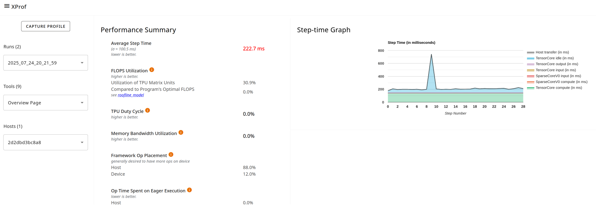

## Overview Page

The overview page provides an aggregated top-level view of how your model
performed during a profile run, how well it utilized hardware resources, and
where time was spent. The overview page acts as a starting point to pursue more
detailed analysis using the other tools within XProf.

### Supported Platforms

Both TPU and GPU are supported.

### Overview Page Components

The overview page differs between TPU and GPU environments. Here is a breakdown
of both variations:

#### TPU (training)

- **Performance Summary** contains:
  - **Average Step Time (training only)**: The step time averaged over all steps
    sampled.
  - **FLOPS Utilization**
  - **TPU Duty Cycle**
  - **Memory Bandwidth Utilization**
  - **Program Goodput Efficiency**: Measures how your model is performing
    relative to ideal performance on this hardware.
  - **TF Op Placement**: Whether the op is running on the host or device.
  - **Op Time Spent on Eager Executions**: This metric helps guide potential
    optimizations related to the eager execution.
  - **Device Compute Precisions**: Reports the percentage of device compute time
  that uses 16-bit computation and 32-bit computation.
- **Step-time Graph (training)** plots a graph of step time (in milliseconds)
  over all the steps sampled. Each of the chart's stacked colors represents
  a category of step time, such as TensorCore idle time or time spent
  communicating with the host.

#### TPU (inference)

For TPU inference jobs, the view is slightly different:

The **Step-Time Graph** section is replaced by the
**Inference Session Latency Breakdown** section and includes a chart of:

- **Inference Session Latency at Percentile**: Shows the proportion of
  the inference job's time spent in host compute, device compute, and
  host-device communication.

In the **Performance Summary** section, **Average Step Time** is replaced by:

- **Average Session Time (inference only)**: A chart showing the distribution of
session times over all sessions, including the average session time.

#### GPU specific

In the **Step-time Breakdown**, the average step time is divided into
multiple categories:

- **All Other Time**: All other time, including Python overhead.
- **Compilation Time**: Time spent on compiling kernels.
- **Output Time**: Time spent on writing output data.
- **Input Time**: Time spent on reading input data.
- **Kernel Launch Time**: Host time for launching kernels.
- **Host Compute Time**: Host computation time.
- **Device Collective Communication Time**: Time spent in collective GPU
  communications.
- **Device to Device Time**: Device-to-device communication time.
- **Device Compute Time**: On-device computation time.

The **Performance Summary** for GPU profiles includes the following fields:

- **TF Op Placement**: Whether the op is running on the host or device.
- **Op Time Spent on Eager Executions**: This metric helps guide potential
  optimizations related to overuse of eager execution (in contrast to the graph
  execution).
- **Device Compute Precisions**: Reports the percentage of device compute time
  that uses 16-bit computation and 32-bit computation.
