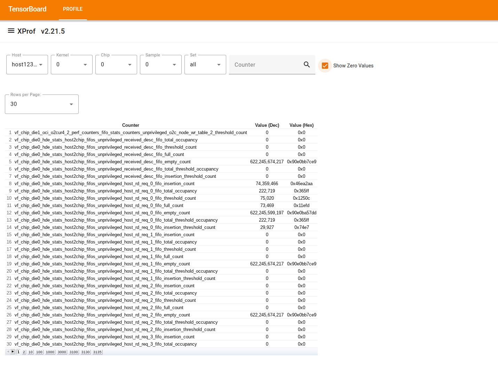

# Perf Counters

```{note}
This tool is currently only available in nightly builds.
```

All accelerators (TPUs and GPUs) provide HW performance counters, and the *Perf
Counters* tool displays HW performance counters collected during a profiling
session in a tabular form. It can be used to filter and search for counters that
are interesting to the user.

### How to use the tool

*   The tool shows a table with 4 columns:

    

    *   The first column is untitled and shows the row number.

    *   "Counter" shows the counter or metric name.

    *   "Value (Dec)" shows the counter's numeric value in decimal.

    *   "Value (Hex)" shows the counter's numeric value in hexadecimal.

*   Above the table there are filters that can be used to display only a subset
    of the rows in the table:

    *   The "Host" filter allows displaying only counters collected on a given
        host machine.

    *   For *TPU* programs:

        *   The "Chip" filter allows displaying only counters collected on a
            given chip.

        *   The "Sample" filter allows selecting which counters sample from the
            profile should be shown. A profile usually contains a single sample
            taken at the end of the profiling period, after clearing the
            counters at the beginning. In some cases a profile might contain
            multiple samples, e.g., when using "Continuous Performance Counter
            Profile".

        *   The "Set" filter allows displaying only counters that belong to the
            selected set, e.g., "issue" selects only the issue counters.

    *   For *GPU* programs:

        *   The "Kernel" filter allows selecting the name of a GPU kernel
            computation fingerprint.

        *   The "Device" filter allows displaying only counters collected on a
            given device (attached to the selected host).

    *   The "Counter" filter has a text box. Typing a string on the text box
        shows only rows where the counter name contains the input string as a
        substring.

*   By default, the tool displays only non-zero counters.
