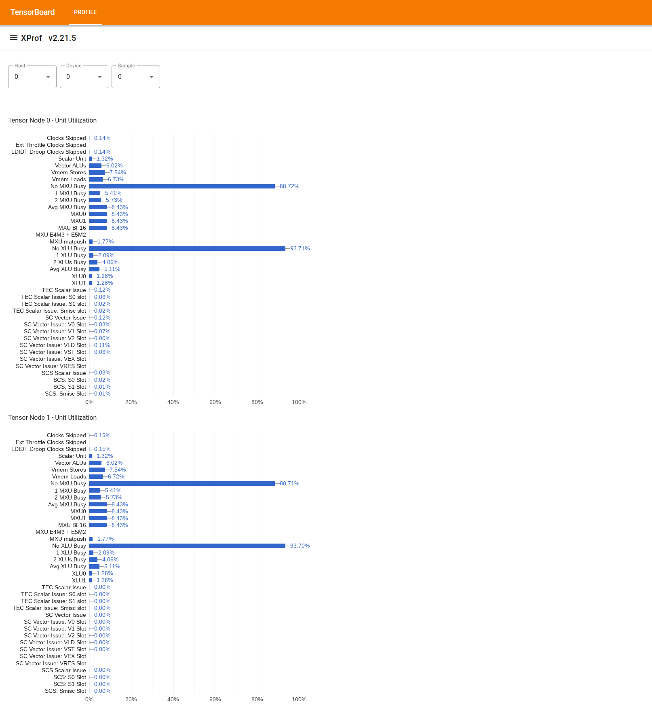

# Utilization Viewer

```{note}
This tool is currently only available in nightly builds.
```

## Goal

The goal of this tool is to provide a bird's eye view of the performance of a
TPU system and allow a performance analyst to spot parts of the system
that may be having performance issues.

## Visualizing Chip-level Utilization

To use the tool, from the "Drawer" on the left, look for the tool "Utilization
Viewer". The tool displays 4 bar charts showing the utilization of execution
units (top 2 charts) and DMA paths (bottom 2 charts) for the 2 Tensor Nodes in a
TPU chip.



*   Hovering over a bar shows a tooltip with details about the utilization:
    "achieved" and (theoretical) "peak" amounts. The utilization percentage
    shown in the bar is obtained by dividing the "achieved" amount over by the
    "peak" amount. The achieved and peak amounts are expressed in units of
    _instructions_ for the execution unit utilization, and _bytes_ for bandwidth
    utilization.

*   The utilization of an execution unit is the *fraction of cycles that the
    unit was busy* within the profiling period.

    The utilization of the following tensor core execution units is shown:

    *   *Scalar Unit*: Computed as the sum of `count_s0_instruction` and
        `count_s1_instruction`, i.e., the number of scalar instructions, divided
        by double the number of cycles, because the scalar unit throughput is 2
        instructions per cycle.
    *   *Vector ALUs*: Computed as the sum of `count_v0_instruction` and
        `count_v1_instruction`, i.e., the number of vector instructions, divided
        by double the number of cycles, because the vector ALUs throughput is 2
        instructions per cycle.
    *   *Vector Stores*: Computed as `count_vector_store`, i.e., the number of
        vector stores, divided by the number of cycles, because the vector store
        throughput is 1 instruction per cycle.
    *   *Vector Loads*: Computed as `count_vector_load`, i.e., the number of
        vector loads, divided by the number of cycles, because the vector load
        throughput is 1 instruction per cycle.
    *   *Matrix Unit (MXU)*: Computed as `count_matmul` divided by 1/8th the
        number of cycles, because the MXU throughput is 1 instruction per 8
        cycles.
    *   *Transpose Unit (XU)*: Computed as `count_transpose` divided 1/8th the
        number of cycles, because XU throughput is 1 instruction per 8 cycles.
    *   *Reduction and Permutation Unit (RPU)*: Computed as
        `count_rpu_instruction` divided by 1/8th the number of cycles, because
        the RPU throughput is 1 instruction per 8 cycles.

    The following figure is a block diagram of the tensor core showing the
    execution units:

    <!-- disableFinding(SNIPPET_INVALID_LANGUAGE) -->
    ```mermaid
    flowchart LR
    classDef redBox fill:#c96665,stroke:#000,stroke-width:2px,color:#000,font-weight:bold;
    classDef whiteBox fill:#fff,stroke:#000,stroke-width:2px,color:#000,font-weight:bold;
    classDef invisible fill:none,stroke:none;

    classDef container fill:#f9f9f9,stroke:#666,stroke-width:3px,stroke-dasharray: 10 5,color:#666,font-size:20px;

    subgraph TensorCore [TensorCore]
        direction LR

        subgraph LeftCol [ ]
            direction TB
            CS["Core<br>Sequencer<br>(CS)"]:::redBox
            VPU["Vector<br>Programmable<br>Unit<br>(VPU)"]:::whiteBox

            CS --> VPU
        end

        subgraph RightCol [ ]
            direction TB
            MXU["Matrix Unit<br>(MXU)"]:::whiteBox
            XU["Transpose Unit<br>(XU)"]:::whiteBox
            RPU["Reduction and<br>Permutation<br>Unit<br>(RPU)"]:::whiteBox
        end

        VPU <==> MXU
        VPU <==> XU
        VPU <==> RPU
    end

    class TensorCore container
    class LeftCol,RightCol invisible
    ```

    For more details on each of these execution units, please refer to
    [TPU architecture](https://docs.cloud.google.com/tpu/docs/system-architecture-tpu-vm).

*   The utilization of DMA paths is the *fraction of bandwidth* (bytes/cycle)
    that was used during the profiling period. It is derived from
    [NF_CTRL counters](perf_counters.md).

    The following figure shows 7 nodes representing sources / destinations of
    DMAs, and the 14 DMA paths in a Tensor Node. The "BMem to VMem"
    and "Bmem to ICI" paths in the figure are actually a shared path accumulated
    by a single counter, shown as "BMem to ICI/VMem" in the tool. A DMA sent to
    ICI is a DMA to a remote HBM or VMEM, while a DMA from/to HIB is a DMA
    from/to host memory.

    <!-- disableFinding(SNIPPET_INVALID_LANGUAGE) -->
    ```mermaid
    flowchart TD
      HIB[HIB]
      HBM[HBM]
      IMem[IMem]
      SMem[SMem]
      BMem[BMem]
      VMem[VMem]
      ICI[ICI]

      HIB --> HBM
      HBM --> HIB

      subgraph Memory_Units [ ]
          direction LR
          style Memory_Units fill:none,stroke:none
          IMem
          SMem
          BMem
          VMem
      end

      HBM --> IMem
      HBM --> SMem
      HBM --> BMem
      HBM --> VMem

      BMem --> VMem
      BMem --> ICI
      VMem --> ICI
      ICI --> VMem

      ICI --> HBM
      VMem --> HBM
      BMem --> HBM
      SMem --> HBM

      HBM --> ICI
    ```
