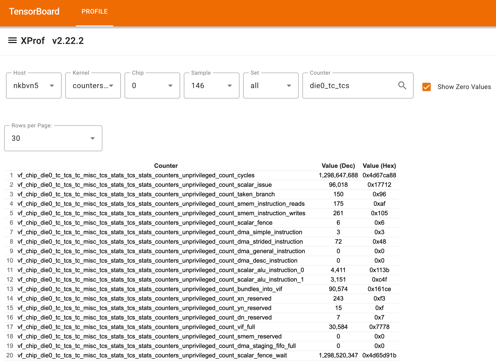
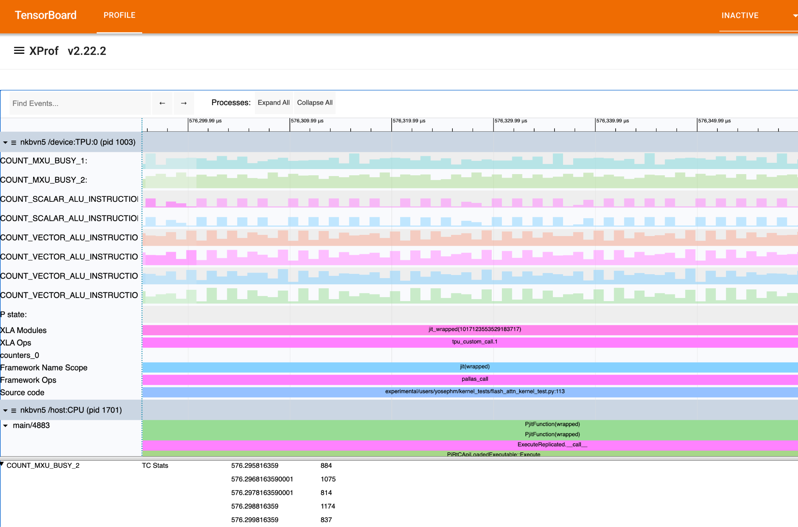

# XProf Kernel User Guide

XProf Kernel is a product suite designed for Pallas Kernel authoring and performance optimization. It enhances
visibility and understanding of "custom-calls" runtime performance—areas that typically remain "black boxes" within
XProf event tracing.

XProf currently offers features like [custom call profiling](./custom_call_profiling.md), which traces static TPU
bundles to link Low-level Optimizer (LLO) instructions back to traced events. While this provides lightweight tracing,
it lacks visibility into the detailed runtime behavior of various TPU components. XProf Kernel fills this gap by
enabling the profiling of fine-grained runtime performance counters. This guide explains how to trigger, collect, and
visualize these counters in a time-series format within the Trace Viewer.

NOTE: This advanced feature is available for Ironwood (TPU7x) and subsequent versions.

## Enabling Fine-Grained Performance Counters

Enable performance counters through the
[Advanced Configuration Options](https://docs.jax.dev/en/latest/profiling.html#advanced-configuration-options) in your
JAX Profiler TPU options, as shown in the example below:

```py
options = jax.profiler.ProfileOptions()
options.advanced_configuration = {
"tpu_enable_periodic_counter_sampling" : True,
"tpu_tc_perf_counter_sampling_options" : (
          'interval_us:1 scaling:0 counter_size_bits:1 indices:10 indices:11 indices:56 indices:57 indices:58'
),
}
```

* `tpu_enable_periodic_counter_sampling`: Set this flag to signal that fine-grained performance counters should be
  collected.
* `tpu_<component>_perf_counter_sampling_options`: Use these flags to configure sampling parameters and specify which
  counter indices to profile for a specific component (components are listed in the
  [Determining Counter Indices](#determining-counter-indices) section). Supported settings are detailed in the table
  below; settings not explicitly defined will use their default values.

| Field | Description | Default |
| :---- | :---- | :---- |
| `interval_us` | The frequency of counter collection in microseconds (*us*). The minimum interval is 1 *us*. | 10000 us |
| `scaling` | The number of bits to right-shift when collecting counter values. Use this if least significant bits (LSBs) are unnecessary for your analysis. Scaling helps reduce payload size and prevents trace drops, while Trace Viewer will automatically restore the original values for display. | 0 |
| `counter_size_bits` | The bit-width of counters in the packed payload. Valid values (n) range from 0 to 3, corresponding to a size of `2^(n+3)` bits: 0=8 bits, 1=16 bits, 2=32 bits, and 3=64 bits. | 3 (64 bits) |
| `indices` | The specific counter indices to profile. These are determined using the perf counters tool (see instructions below). | none |

## Determining Counter Indices

Use the **Perf Counters** tool to identify the specific indices for the component you wish to profile. Follow these steps:

1. Navigate to perf counters in any TensorBoard trace supporting perf counters.
2. Enable “Show Zero Values” to get a complete list of counters profiled.
3. Search for your target **component**. Use the **bolded** keywords from the table below as search queries to locate
   the correct counters:

| Component | Keyword |
| :---- | :---- |
| TC | `vf_chip_die0_tc_tcs_tc_misc_tcs_stats_tcs_stats_counters` |
| SCS | `vf_chip_die0_sc_0_scs_sc_stats_counters` |
| SCTD | `vf_chip_die0_sc_0_sctd_0_sc_stats_counters` |
| SCTC | `vf_chip_die0_sc_0_sctc_0_sc_stats_counters` |
| CMN | `vf_chip_die0_cmn_cmnur_0_cmn_stats_debug_fixed_stats_counters` |
| ICR | `vf_chip_chiplet_icr_icr_data_0_debug_domain_icr_data_stats_packet_counters` |

4. Identify your counter in the resulting table. Calculate the index as (**row index - 1**). Below is an example of the
   perf counters tool and the corresponding TC counters.

   

## Visualizing Runtime Counters

In the Trace Viewer, collected counters appear as lines, based on the specified indices and frequency. Selecting counter
points opens a bottom modal displaying its value, including the increment since the last data point and its
corresponding timestamp.



## Coming Soon

In addition to periodic performance counter collection, users will soon be able to capture counters triggered by
external events, such as the execution of custom calls and TPU instructions. This will help attribute counter triggers
and compare runtime versus static execution to identify bottlenecks at the bundle level and beyond. Please stay tuned
for updates!
