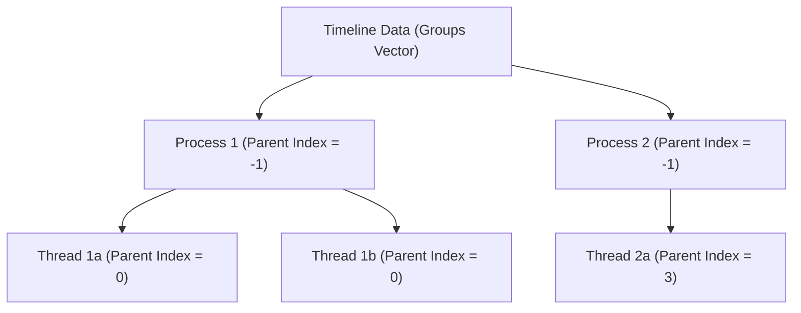

# Trace Viewer V2: Track Hierarchy and Reordering Design Doc

This document explains the data structures, layout hierarchy, and reordering
mechanics used in the Trace Viewer V2 timeline component.

## 1. Overview
Previously, Trace Viewer V2 managed timeline groups (processes, threads, and
counters) as a purely flat sequence. To support collapsible tracks, track
pinning, hiding, and track reordering, the flat list of tracks is organized
into a parent-child tree hierarchy.

## 2. Parent-Child Relationship Representation
Each track is represented by the `Group` struct. Relationships are stored
explicitly:

* **`parent_index`**: The `0`-based index of the parent process in the raw
  `groups` vector, or `-1` if it is a top-level process.
* **`child_indices`**: A list of child indexes (threads or counters) nested
  directly under this group.
* **`has_children`**: A boolean flag indicating if the track has nested
  descendant tracks.

In production, these links are parsed and populated during trace load time
inside `data_provider.cc` (e.g. `PopulateSyncProcessTrack` and
`PopulateCounterTrack`). For mock tests, they are set explicitly in the test
fixture configurations.

## 3. UI Layout and Visibility
The UI relies on two complementary lists:
1. **`groups`**: The actual structured vector containing original indexes and
   parent-child metadata.
2. **`flattened_groups`**: A pre-computed vector of group pointers visited in
   pre-order DFS. Only visible (expanded or un-hidden) tracks are copied into
   the sequence when track management is enabled or standard views are
   updated.

### Collapsed/Expanded State
When a parent track is collapsed (`expanded = false`),
`UpdateLevelPositions()` marks all descendant tracks (whose nesting level
exceeds the parent's level) as `visible = false` and skips their vertical
offset allocation during rendering.

## 4. Track Reordering (CL 2 Preview)
When track management is enabled, tracks can be dragged and dropped. Sibling
reordering relies on the parent-child pointers:
1. **Verification**: Sibling drag boundary constraint is checked
   (`source->parent_index == target->parent_index`).
2. **DFS Rebuild**: The parent's child list is re-arranged, and a new groups
   array is rebuilt recursively from the roots downwards.
3. **Translation**: Translation vectors map old indices to new indices to
   sequentially shift levels, events, flow lines, counter data, and
   selections.
