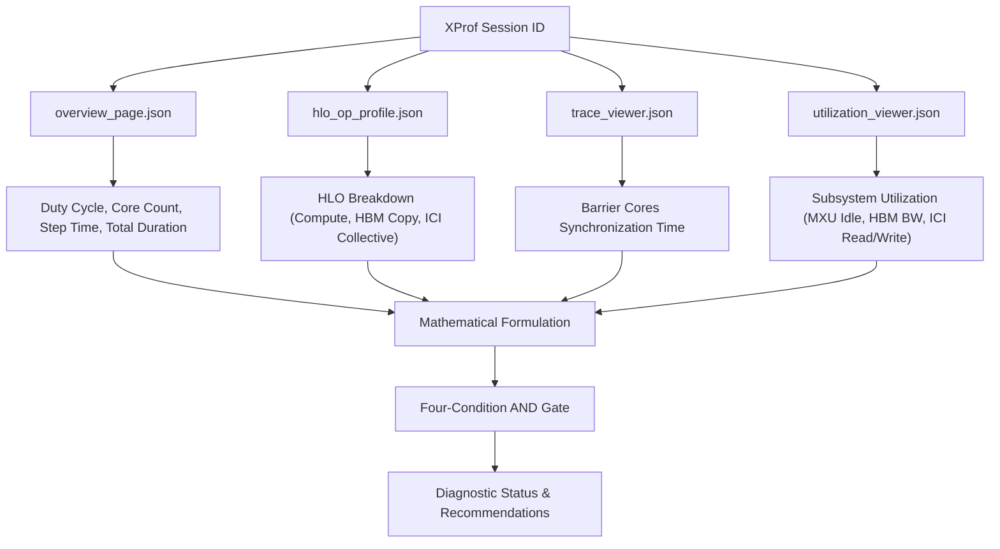

# Host-Boundness Diagnostic Tool (`check_host_boundness`)

## Overview

The `check_host_boundness` tool diagnoses whether a TPU workload is suffering
from host-side bottlenecks (e.g., input data infeed delays, Python runtime
overhead, or synchronous checkpointing) rather than accelerator compute or
memory bandwidth limits.

This implementation replicates the canonical diagnostic pipeline used in
Lumini (`xprof_check_host_boundness`), grounding decisions in multi-source
telemetry across 4 XProf views rather than single-metric heuristics.

---

## 1. Data Sources & Architecture

The diagnostic pipeline combines telemetry from four distinct XProf views:



1. **`overview_page.json`**:
   - `device_duty_cycle_percent`: Percentage of time device executes
     instructions.
   - `device_core_count`: Total TPU TensorCores in the topology.
   - `steptime_ms_average`: Mean execution duration per step.
   - `rows`: Array of recorded steps. Total duration is calculated as
     `total_duration_ms = steptime_ms_average * len(rows)`.
   - *Guard*: If `total_duration_ms == 0.0` or `len(rows) == 0`, status returns
     `INSUFFICIENT_DATA`.

2. **`hlo_op_profile.json` (Category AST)**:
   - Recursively traverses category-grouped AST (`byCategory`) across leaf
     operations:
     - **Compute Time**: All compute kernels (e.g., matmul, convolution,
       elementwise).
     - **HBM Copy Time**: Memory transfers (`copy-start`, `copy`, `copy-done`).
     - **ICI Collective Time**: Inter-chip communication (`all-reduce`,
       `all-gather`, `all-to-all`, `reduce-scatter`, `collective-broadcast`,
       `collective-permute`).
   - Scaled per core: `scaled_time_ms = (time_ps / 1e9) / core_count`.

3. **`trace_viewer.json` (Barrier Cores Telemetry)**:
   - Identifies host with active device traces.
   - Sums durations of `barrier-cores` trace slices and divides by event
     count to get average synchronization latency: `avg_barrier_ms_per_event`.
   - Scales by step count:
     `scaled_barrier_time_ms = avg_barrier_ms_per_event * number_of_steps`.

4. **`utilization_viewer.json` (Hardware Subsystem Utilization)**:
   - Queries `idleness_percent` (percentage of time MXU is completely idle).
   - Queries `hbm_bandwidth_utilization_percent` (HBM Read + Write bandwidth
     relative to peak).
   - Queries `ici_read_utilization_percent` and `ici_write_utilization_percent`
     (Inter-Chip Interconnect bandwidth).
   - Features multi-host fallback: If Host 0 has no data, iterates over
     available hosts until valid hardware telemetry is loaded.

---

## 2. Mathematical Formulation

### 2.1 Pure Idle Time
Raw idle time includes both host starvation and accelerator cross-core
synchronization. To isolate pure host wait time, synchronization overhead is
subtracted:

$$
\text{sum\_scaled\_hlo\_ms} =
  \text{scaled\_compute\_ms} +
  \text{scaled\_hbm\_ms} +
  \text{scaled\_ici\_ms}
$$

$$
\text{idle\_time\_ms} =
  \text{total\_duration\_ms} - \text{sum\_scaled\_hlo\_ms}
$$

$$
\text{pure\_idle\_time\_ms} =
  \max(0.0, \text{idle\_time\_ms} - \text{scaled\_barrier\_time\_ms})
$$

### 2.2 Idle Time Ratio
Idle time ratio represents the proportion of host idle wait relative to active
TPU computation:

$$
\text{active\_compute\_ms} =
  \text{total\_duration\_ms} - \text{pure\_idle\_time\_ms}
$$

$$
\text{idle\_time\_ratio\_pct} =
  \left( \frac{\text{pure\_idle\_time\_ms}}{\text{active\_compute\_ms}} \right)
  \times 100\%
$$

### 2.3 Equivalent Idle Chips (Opportunity Size)
Measures the absolute hardware waste in units of idle chips to prioritize
optimizations by cluster scale:

$$
\text{absolute\_idle\_fraction} =
  \frac{\text{pure\_idle\_time\_ms}}{\text{total\_duration\_ms}}
$$

$$
\text{equivalent\_idle\_chips} =
  \text{device\_core\_count} \times \text{absolute\_idle\_fraction}
$$

---

## 3. Decision Algorithm (Pseudo-Code)

A workload is declared `HOST_BOUND` if and only if **all four conditions hold
simultaneously**:

```python
# 1. High Host Starvation
is_pure_idle_high = idle_time_ratio_pct > 10.0

# 2. High Matrix Unit Idleness
is_mxu_idle_high = idleness_percent > 70.0

# 3. Not Memory Bandwidth Bound
is_hbm_util_low = hbm_bandwidth_utilization_percent < 30.0

# 4. Not Inter-Chip Communication Bound
is_ici_util_low = (ici_read_utilization_percent < 30.0) and (
    ici_write_utilization_percent < 30.0
)

if (
    is_pure_idle_high
    and is_mxu_idle_high
    and is_hbm_util_low
    and is_ici_util_low
):
  status = "HOST_BOUND"
elif duty_cycle > 50.0 and (not hlo_data_available or not is_pure_idle_high):
  if not hlo_data_available:
    status = "UNKNOWN"  # High duty cycle reported, but missing HLO telemetry
  else:
    status = "NOT_HOST_BOUND"
else:
  status = "NOT_HOST_BOUND"
```

---

## 4. Example Output

```json
{
  "status": "HOST_BOUND",
  "metrics": {
    "tpu_duty_cycle_percent": 15.0,
    "idle_time_ratio_percent": 100.0,
    "equivalent_idle_chips": 4.0,
    "mxu_idleness_percent": 99.52,
    "hbm_bandwidth_utilization_percent": 2.98,
    "ici_read_utilization_percent": 16.88,
    "ici_write_utilization_percent": 16.88,
    "scaled_compute_time_ms": 0.0,
    "scaled_hbm_time_ms": 0.0,
    "scaled_ici_time_ms": 0.0,
    "scaled_barrier_time_ms": 500.0,
    "pure_idle_time_ms": 500.0,
    "total_duration_ms": 1000.0,
    "number_of_steps": 10,
    "core_count": 8
  },
  "reasons": [
    "Workload is host-bound: Idle Time Ratio exceeds 10.0% of active compute."
  ],
  "recommendations": [
    "Opportunity Size: Hardware waste = 4.0 idle chips.",
    "Review data pipeline for inefficiencies (e.g., tf.data or PyGrain).",
    "Provide `func_name` to enable automated Dispersion Analysis."
  ]
}
```
